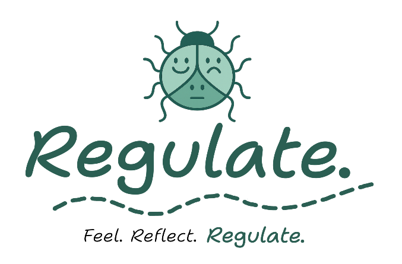
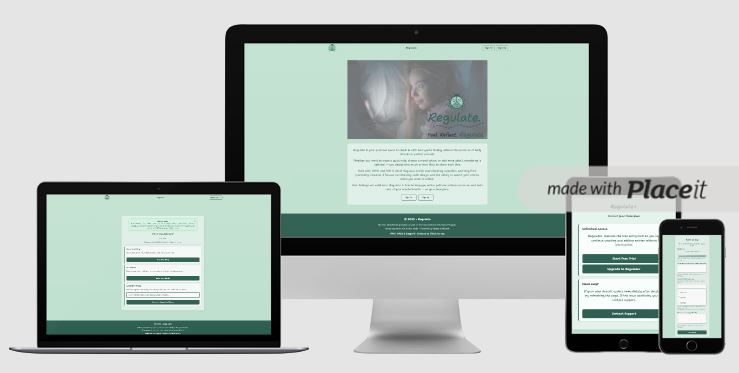
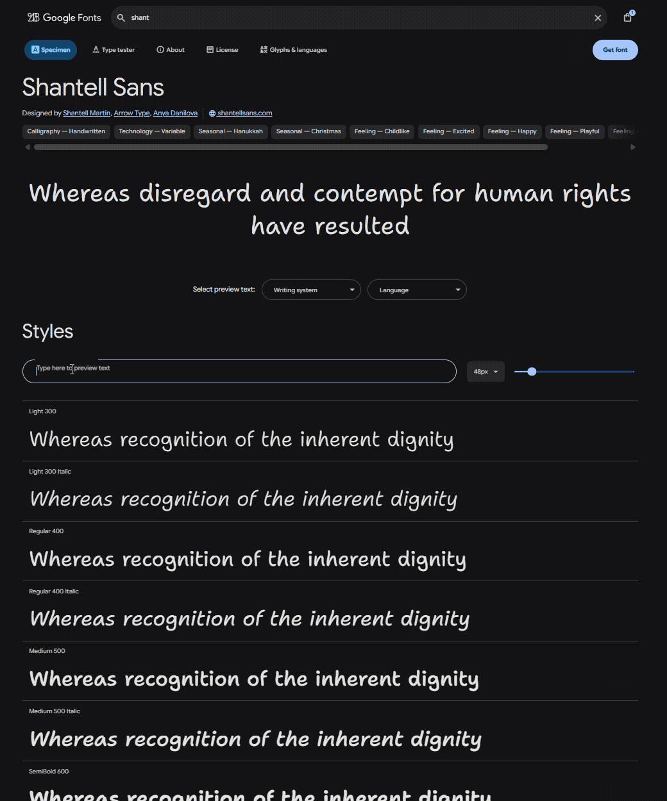
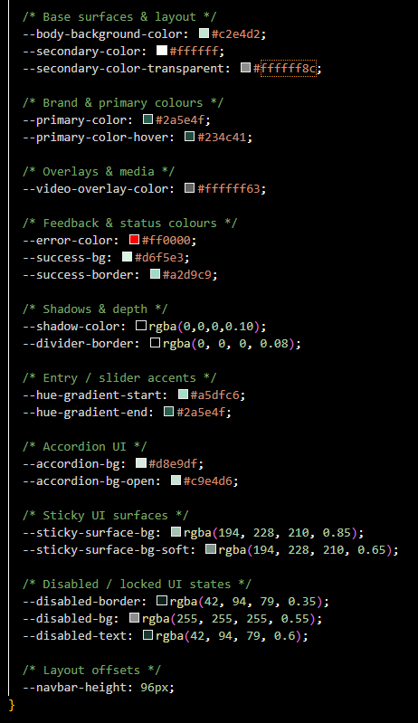
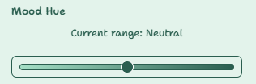
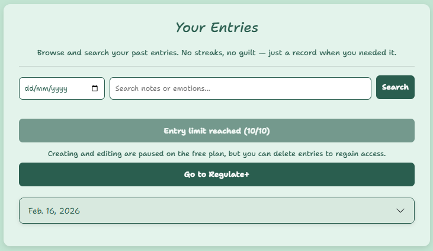
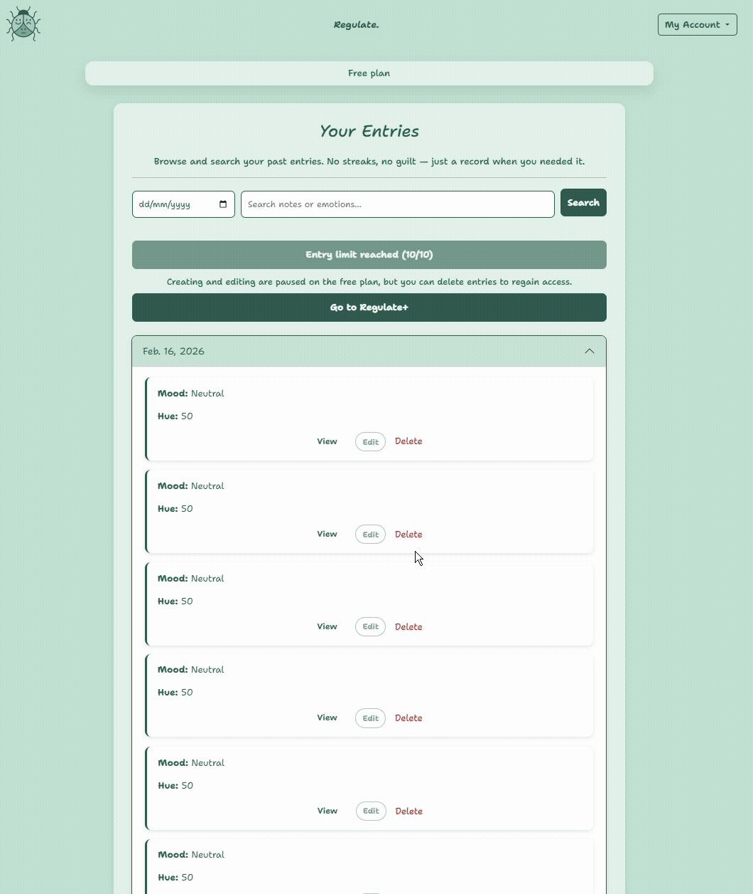

# Regulate



----------

A Trauma-Informed Emotional Regulation Web Application  
*(Milestone Project Four – Full-Stack Django Application)*

**Project Requirements (Main Technologies):**

* HTML, CSS, JavaScript, Python+Django
* Relational database (PostgreSQL recommended for production)
* Stripe payments (subscriptions and free trials)
* External APIs (used optionally and with safe fallbacks)

Visit the deployed site [here](https://regulate-ms4-ceri-a1ea7fce9e89.herokuapp.com/) on Heroku

View the Repository [here](https://github.com/Ceri-Jane/milestone_project_four) on Github

View the Project board [here](https://github.com/users/Ceri-Jane/projects/11) on Github - Projects

---

> Access the test login details here: **[Test User Accounts (for assessors)](documentation/TESTING.md#test-user-accounts)**

---



----------
## Contents
----------

1. [Project Summary](#project-summary)

2. [Audience & Purpose](#audience--purpose)

3. [Mobile-First Design Philosophy](#mobile-first-design-philosophy)

4. [Personal Rationale & Ethical Intent](#personal-rationale--ethical-intent)

5. [User Stories](#user-stories)
   - [Overview](#overview)
   - [Must-Have User Stories](#must-have-user-stories)
   - [Should-Have User Stories](#should-have-user-stories)
   - [Could-Have User Stories](#could-have-user-stories)

6. [UX Design – Five Planes](#ux-design--five-planes)
   - [Strategy](#strategy)
   - [Scope](#scope)
     - [Functional Scope](#functional-scope)
     - [Out of Scope (Planned for Future Development)](#out-of-scope-planned-for-future-development)
   - [Structure](#structure)
   - [Skeleton](#skeleton)
     - [Wireframes](#wireframes)
   - [Surface](#surface)

7. [Data Model & Relationships](#data-model--relationships)

8. [Features](#features)
   - [CRUD Functionality & Immediate UI Reflection](#crud-functionality--immediate-ui-reflection)

9. [Environment Variables: `.env` vs `.env.example`](#environment-variables-env-vs-envexample)
   - [`.env` (Private)](#env-private)
   - [`.env.example` (Public)](#envexample-public)
   - [Production Configuration (Heroku)](#production-configuration-heroku)
   - [Security & Assessment Alignment](#security--assessment-alignment)

10. [Email Delivery Method (Project Configuration)](#email-delivery-method-project-configuration)
    - [Future Production Intent](#future-production-intent)

11. [Accessibility](#accessibility)
    - [Structural Accessibility](#structural-accessibility)
    - [Visual & Interaction Accessibility](#visual--interaction-accessibility)
    - [Keyboard & Navigation Support](#keyboard--navigation-support)
    - [Form & Authentication Accessibility](#form--authentication-accessibility)
    - [Neurodivergent-Friendly Design Choices](#neurodivergent-friendly-design-choices)
    - [Error Handling & Stability](#error-handling--stability)

12. [Colour Palette & Branding](#colour-palette--branding)
    - [Branding Concept](#branding-concept)
    - [Tagline Meaning](#tagline-meaning)
    - [Logo Symbolism](#logo-symbolism)
    - [Typography](#typography)
    - [Colour Psychology & Palette](#colour-psychology--palette)
      - [Core Brand Colours](#core-brand-colours)
    - [Hue Slider Gradient](#hue-slider-gradient)
    - [Feedback & Status Styling](#feedback--status-styling)
    - [Surface & Depth System](#surface--depth-system)
    - [Disabled & Locked States](#disabled--locked-states)
    - [Overall Visual Identity](#overall-visual-identity)

13. [API Usage – Supportive Phrases (Affirmations API)](#api-usage--supportive-phrases-affirmations-api)
    - [How It Is Used](#how-it-is-used)
    - [Error Handling & Fallback Behaviour](#error-handling--fallback-behaviour)
    - [Architectural Considerations](#architectural-considerations)

14. [Validation & Testing](#validation--testing)
    - [Testing File](#testing-file)
    - [Robustness & Defensive Design Confirmation](#robustness--defensive-design-confirmation)
    - [Manual Testing](#manual-testing)
    - [Automated Testing](#automated-testing)
    - [Key Differences](#key-differences)
    - [Code Quality & Standards Compliance](#code-quality--standards-compliance)

15. [Development Process & Iteration](#development-process--iteration)
    - [Initial Architecture Decisions](#initial-architecture-decisions)
    - [Iterative Development Approach](#iterative-development-approach)
    - [Refactoring & Improvements](#refactoring--improvements)
    - [Version Control Strategy](#version-control-strategy)
    - [Test-First Development (TDD-Inspired)](#test-first-development-tdd-inspired)

16. [Deployment](#deployment)

17. [Future Enhancements](#future-enhancements)
    - [Production Email Service](#production-email-service)
    - [Emotion Insights & Analytics](#emotion-insights--analytics)
    - [Dark Mode](#dark-mode)
    - [Optional Account Email Verification](#optional-account-email-verification)
    - [Secure Production Logging](#secure-production-logging)
    - [Enhanced Subscription Controls](#enhanced-subscription-controls)
    - [Guided Emotional Prompts](#guided-emotional-prompts)
    - [API Expansion](#api-expansion)
    - [Accessibility Enhancements](#accessibility-enhancements)
    - [Intelligent Distress Language Detection (Ethical AI Enhancement)](#intelligent-distress-language-detection-ethical-ai-enhancement)

18. [Technologies Used](#technologies-used)

19. [Credits](#credits)

20. [Project Ownership & Attribution](#project-ownership--attribution)


[Back to contents](#contents)

---
## Project Summary
---

**Regulate** is a full-stack Django web application designed to support **emotional regulation through low-pressure mood check-ins**, rather than traditional journalling.

The application allows users to engage with their emotions in a way that adapts to their **current emotional and cognitive capacity**, without requiring consistency, explanation, or written reflection.

Users can:

- Log their emotional state using a **non-judgmental hue scale**
- Select from **predefined emotion words** when writing feels difficult
- Add optional notes only when they feel able
- Create multiple entries per day to reflect emotional fluctuation
- Review past entries without calendars, streaks, or performance metrics
- Access trusted **UK mental-health support resources**
- Choose between a **free tier**, **one-time free trial**, or **low-cost subscription**

Regulate is intentionally designed to reduce overwhelm, remove shame-based interaction patterns, and allow users to engage at varying emotional capacities.

[Back to contents](#contents)

---
## Audience & Purpose
---

Regulate is designed for:

- Users who struggle with emotional regulation  
- People with ADHD, BPD, trauma histories, or executive dysfunction  
- Anyone who finds traditional journalling overwhelming or inaccessible  

Unlike many wellbeing applications, Regulate:

- Does not require daily use  
- Does not use streaks, calendars, or scoring systems  
- Does not label emotions as “good” or “bad”  
- Does not penalise inconsistency  

The purpose of the application is not diagnosis or treatment, but to provide a **calm, flexible space** for recognising and reflecting on emotions without judgement or pressure.

[Back to contents](#contents)

---
## Mobile-First Design Philosophy
---

Regulate was designed **mobile-first**, with careful consideration of how and when users are most likely to need emotional support.

For many people experiencing emotional distress, fatigue, or executive dysfunction, accessing a laptop or desktop computer can be a barrier in itself. Prioritising mobile usability allows users to:

- Check in from bed or a quiet space  
- Use the application one-handed  
- Engage in short, low-effort interactions  
- Avoid dense layouts or complex navigation  

While Regulate is fully responsive and usable across **mobile, tablet, and desktop**, the mobile experience was treated as the primary design context. Larger screen layouts enhance the experience but do not change the core interaction model.

This approach helps ensure the application remains accessible at the moments it is most needed.

[Back to contents](#contents)

---
## Personal Rationale & Ethical Intent
---

Regulate was originally created in response to gaps encountered in existing mood-tracking and journalling tools.

Many applications require written reflection during moments of distress, emphasise consistency through calendars or streaks, or visually highlight missed days. For users who experience emotional dysregulation, these patterns can increase avoidance rather than support regulation.

Regulate was intentionally designed to:

- Remove pressure to “perform” wellbeing  
- Allow entries to be minimal or detailed  
- Respect fluctuating emotional and cognitive capacity  
- Avoid punitive or guilt-based interaction patterns  
- Prioritise emotional safety over data density  

Although informed by lived experience, Regulate is not limited to any single diagnosis. Design decisions were made to support a wide range of users who may struggle with emotional articulation, overwhelm, or inconsistent capacity, without requiring disclosure or labelling.

Ethical considerations also informed technical decisions, including:

- Protecting user privacy by restricting administrative access to emotional content  
- Ensuring users never lose access to their own data  
- Using external services only where optional and safely fall-backed  
- Limiting support resources to the UK at present to ensure accuracy and responsibility  

[Back to contents](#contents)

---
## User Stories
---

### Overview

In a real-world development environment, a project would typically begin with a formal requirements specification provided by stakeholders. As this project did not include predefined requirements, a comprehensive set of user stories was created to guide development.

These user stories define clear goals from the perspective of both **end users** and the **site owner**, ensuring that Regulate remains user-centred, ethically designed, and technically robust. They also support the application of the **Five Planes of UX Design**, allowing features to be prioritised and evaluated against real user needs.

Stories are grouped into **Must-Have**, **Should-Have**, and **Could-Have** categories to clearly distinguish between implemented functionality, enhancements, and planned future development.

**Please click [here](documentation/USER-STORIES.md) for detailed User Stories.**


### Must-Have User Stories

- Site User - User Registration  
- Site User - User Login & Logout  
- Site User - Create a Mood Entry  
- Site User - Emotion Words as Low-Effort Input  
- Site User - View Entries Without a Calendar  
- Site User - Edit an Entry With History  
- Site User - Delete an Entry Safely  
- Site User - Filter Entries by Date  
- Site User - Dashboard Overview  
- Site User - Supportive Phrases  
- Site User - Access Support Resources  
- Site User - Contact the Site Owner  
- Site Owner – Free Tier With Limits  
- Site Owner – Trial Abuse Prevention  
- Site Owner – Privacy-Focused Administration  

### Should-Have User Stories

- Site User - Keyword Search  
- Site User - Announcement Awareness  

### Could-Have User Stories

- Site User - Export Entries  
- Site User - Mood Pattern Visualisation  
- Site Owner – Referral Discounts  
- Site Owner – International Expansion  

[Back to contents](#contents)

---
## UX Design – Five Planes
---

Regulate follows the **Five Planes of UX Design** to ensure that emotional safety, accessibility, and usability inform every design and technical decision. Each plane builds upon the previous one, creating an experience that supports users at varying emotional and cognitive capacities without pressure or judgement.

[Back to contents](#contents)

---

### Strategy

The core strategy of Regulate is built around supporting emotional check-ins **without demanding explanation, consistency, or performance**.

The primary user needs addressed are:

1. **A way to acknowledge emotional state quickly and gently**  
   → even when writing or reflection feels impossible.

2. **A space to return to emotional history without guilt or comparison**  
   → allowing review only when the user feels ready.

Additional strategic goals include:

- Reducing cognitive load during emotional distress  
- Supporting engagement without written input  
- Avoiding judgement, comparison, or productivity-based feedback  
- Allowing ethical monetisation without restricting access to past data  
- Ensuring the app remains usable during low-energy or high-stress moments  

To support these goals, several features commonly found in wellbeing apps were intentionally excluded, including:

- Calendars  
- Streaks  
- Mood “scores” or ratings  
- Gamification or reward systems  

These omissions are deliberate design choices aligned with trauma-informed and neurodivergent-friendly UX, prioritising emotional safety over engagement metrics.

[Back to contents](#contents)

---

### Scope

The scope of Regulate was carefully defined to balance emotional safety, technical feasibility, and long-term sustainability.

#### Functional Scope

The application includes:

- Secure user authentication and account management  
- Mood entry creation using a required hue input  
- Optional emotion word selection to support low-effort recognition  
- Optional written notes for deeper reflection  
- Entry editing with automatic revision history  
- A calm dashboard overview  
- UK-based support resources and a contact system  
- Free tier, one-time trial, and subscription logic  

Each feature was selected to support flexible engagement without forcing users into a single interaction style.

#### Out of Scope (Planned for Future Development)

The following features were intentionally deferred to maintain focus and emotional clarity in the initial release:

- Mood analytics and visual graphs  
- Exporting entries as PDF or text  
- Referral and discount systems  
- International support resources  

These features are documented for future expansion once sufficient usage patterns and safeguarding considerations have been explored.

[Back to contents](#contents)

---

### Structure

The structure of Regulate mirrors real emotional workflows, rather than rigid time-based tracking or productivity models.

The primary flow is:

1. **Check in**  
2. **Reflect (optionally)**  
3. **Review later, when ready**

Navigation and page hierarchy are kept intentionally simple to minimise decision fatigue. Core areas include:

- Dashboard  
- Entries  
- Entry detail and edit views  
- Support and contact pages  
- Account management  

All user-facing templates extend a shared `base.html`, providing:

- Consistent navigation and layout  
- Centralised styling and structure  
- Reduced code duplication  
- Improved maintainability  
- Predictable, accessible page patterns  

This structural consistency helps users orient themselves quickly, even during moments of emotional distress.

[Back to contents](#contents)

---

### Skeleton

The skeleton layer focuses on **reducing effort and visual noise**, particularly on mobile devices.

Key layout decisions include:

- A dashboard that acts as a calm “home base”  
- Entry lists grouped only by dates that contain data  
- No calendar grids or empty states that highlight absence  
- Minimal form fields, with only one required input  
- Clear separation between:
  - **Recognition** (emotion words)
  - **Expression** (optional notes)

Forms are designed to be completed in seconds if needed, while still allowing space for deeper reflection when the user has capacity.

#### Wireframes

Wireframes and layout planning are documented in:
**[`WIREFRAMES.md`](documentation/WIREFRAMES.md)**

[Back to contents](#contents)

---

### Surface

The visual design of Regulate prioritises calmness, clarity, and neutrality.

Key surface design principles include:

- Soft, non-intrusive colour contrasts  
- Neutral emotional language throughout the interface  
- Clear spacing and readable typography  
- A non-clinical, non-medical aesthetic  

Colours and labels are deliberately avoided as indicators of emotional success or failure. The interface does not imply that any emotional state is better or worse than another.

The overall visual language is designed to feel supportive without being prescriptive, allowing users to project their own meaning onto their entries.

[Back to contents](#contents)

---
## Data Model & Relationships
---

The data model is documented in:
**[`DATA-MODEL.md`](documentation/DATA-MODEL.md)**

[Back to contents](#contents)

---
## Features
---

This project includes a dedicated Features document that provides a comprehensive breakdown of Regulate’s functionality, architecture, and design decisions.

The Features documentation explains:

- Core user journeys (authentication, mood tracking, dashboard behaviour)
- Subscription state logic and Regulate+ behaviour
- Stripe integration and billing management
- Admin controls and privacy safeguards
- Success/error messaging and defensive UX handling
- Custom error pages and production safeguards

Rather than summarising these sections here, the full feature set is documented separately for clarity and structure.

Please use the link below to view the complete Features breakdown:

**[View Full Features Documentation](documentation/FEATURES.md)**

[Back to contents](#contents)

---

### CRUD Functionality & Immediate UI Reflection

Regulate implements full CRUD (Create, Read, Update, Delete) functionality for core emotional data models.

- Users can create new mood entries.
- Users can read and review past entries.
- Users can update entries, with automatic revision tracking.
- Users can delete entries safely.

All create, update and delete actions are immediately reflected in the user interface via redirect messaging and refreshed querysets. No manual page refresh is required for data consistency.

All data operations are scoped to the authenticated user, ensuring users cannot access or modify another user’s data.


[Back to contents](#contents)

---

---
## Environment Variables: `.env` vs `.env.example`
---

Regulate uses environment variables to securely manage sensitive configuration data.  
No secret keys or credentials are hard-coded into the repository.

Environment variables are used to store:

- `SECRET_KEY`
- `DEBUG`
- `DATABASE_URL`
- `STRIPE_SECRET_KEY`
- `STRIPE_PUBLISHABLE_KEY`
- `STRIPE_WEBHOOK_SECRET`
- `STRIPE_PRICE_ID`
- Email backend configuration (where applicable)

[Back to contents](#contents)

---

### `.env` (Private)

The `.env` file contains real secret values used during local development.

This file:

- Is excluded via `.gitignore`
- Is **never committed to GitHub**
- Contains real API keys and credentials

Example (local development only):

```
SECRET_KEY=real-django-secret-key
DEBUG=True
DATABASE_URL=your_local_database_url

STRIPE_SECRET_KEY=sk_test_...
STRIPE_PUBLISHABLE_KEY=pk_test_...
STRIPE_WEBHOOK_SECRET=whsec_...
STRIPE_PRICE_ID=price_...
```

[Back to contents](#contents)

---

### `.env.example` (Public)

The `.env.example` file is included in the repository.

It contains placeholder values to document required environment variables without exposing secrets.

Example:

```
SECRET_KEY=change_me
DEBUG=False
DATABASE_URL=your_database_url_here

STRIPE_SECRET_KEY=your_stripe_secret_key
STRIPE_PUBLISHABLE_KEY=your_stripe_publishable_key
STRIPE_WEBHOOK_SECRET=your_stripe_webhook_secret
STRIPE_PRICE_ID=your_stripe_price_id
```

This file allows:

- Future developers to configure the project correctly  
- Assessors to see which variables are required  
- Safe deployment setup without exposing credentials  

[Back to contents](#contents)

---

### Production Configuration (Heroku)

In production, environment variables are configured directly in Heroku Config Vars.

This ensures:

- No secret data exists in the codebase  
- Secure separation between code and credentials  
- Safe deployment aligned with industry best practice  

[Back to contents](#contents)

---

### Security & Assessment Alignment

This approach follows professional security standards by:

- Separating secrets from version control  
- Preventing accidental credential leaks  
- Supporting environment-based configuration  
- Demonstrating secure deployment knowledge  

[Back to contents](#contents)

---
## Email Delivery Method (Project Configuration)
---

For this Milestone Project Four submission, Regulate uses Django’s **console email backend**.

This means:

- Password reset emails are printed to the terminal  
- No real emails are sent externally  
- No third-party SMTP service is configured  

The full password reset workflow is functional — the reset link is simply retrieved from the server logs instead of an inbox.

[Back to contents](#contents)

---

### Future Production Intent

For a live production version, the email backend would be migrated to a secure provider such as Mailtrap, SendGrid, or another SMTP service.

In production this would:

- Deliver reset emails directly to users  
- Use secure environment variables for credentials  
- Prevent exposure of sensitive configuration  

Only the email transport method would change — the reset logic itself is already fully implemented and secure.


[Back to contents](#contents)

---
## Accessibility
---

Regulate has been designed with accessibility as a foundational principle, not an afterthought. The platform follows WCAG-aligned best practices to ensure users can engage safely and comfortably across devices, assistive technologies, and cognitive needs.

### Structural Accessibility

- Semantic HTML used throughout  
- Logical heading hierarchy across all pages  
- Clear, descriptive page `<title>` tags  
- Unique meta descriptions per page  
- ARIA labels applied to interactive components where appropriate  
- Form labels explicitly associated with inputs  

This ensures screen readers can accurately interpret page structure and announce context clearly.

[Back to contents](#contents)

---

### Visual & Interaction Accessibility

- High-contrast colour combinations  
- Consistent visual hierarchy  
- Visible focus states for keyboard users  
- Large, touch-friendly buttons and form fields  
- Clear error and success message styling  
- No flashing or animated distraction  

The design avoids sensory overload and reduces visual clutter, supporting users with ADHD, anxiety, or cognitive fatigue.

[Back to contents](#contents)

---

### Keyboard & Navigation Support

- All interactive elements are keyboard accessible  
- Links and buttons follow predictable conventions  
- No interaction requires a mouse  
- Footer “Back to top” shortcut reduces scrolling effort  

Navigation remains consistent across authentication states to reduce confusion.

[Back to contents](#contents)

---

### Form & Authentication Accessibility

- Minimal required fields  
- Clear inline validation feedback  
- Password visibility toggle (SVG eye icon) for improved usability  
- Calm, non-technical error messaging  
- No forced time limits on input  

The goal is to reduce friction, especially during emotionally vulnerable moments.

[Back to contents](#contents)

---

### Neurodivergent-Friendly Design Choices

Regulate was built intentionally with ADHD and BPD-informed UX considerations:

- No streaks or performance metrics  
- No urgency-based messaging  
- No countdown timers  
- Default neutral slider positioning  
- Optional input fields clearly marked  
- Gentle, non-judgemental language  

These decisions support emotional regulation rather than gamification.

[Back to contents](#contents)

---

### Error Handling & Stability

- Custom 404 and 500 pages  
- Graceful API fallbacks (e.g., supportive phrases)  
- Clear cancellation messaging in payment flows  
- No exposure of technical stack traces to end users  

This ensures users are never presented with confusing or alarming technical output.

[Back to contents](#contents)

---

Accessibility in Regulate is not limited to technical compliance — it extends to emotional and cognitive accessibility, reinforcing the platform’s core goal:

> A safe, calm space to reflect — without pressure.

[Back to contents](#contents)

---
## Colour Palette & Branding
---

### Branding Concept

The name **Regulate** reflects the platform’s core purpose: supporting users in noticing, understanding, and gently regulating their emotional states.

Rather than positioning itself as a productivity tool or self-improvement tracker, Regulate is intentionally framed as a space for emotional awareness without pressure. The branding avoids clinical language, competitive framing, or gamified “optimisation” culture.

Instead, the identity centres around:

- Emotional awareness  
- Calm reflection  
- Self-compassion  
- Personal autonomy  
- Psychological safety  

The platform does not promise transformation.  
It supports observation first.

[Back to contents](#contents)

---

### Tagline Meaning

> **Feel. Reflect. Regulate.**

The tagline captures the three-stage philosophy behind the application.

**Feel**  
Acknowledging emotion without suppressing or judging it.

**Reflect**  
Taking a moment to understand what that emotion means personally.

**Regulate**  
Responding gently and intentionally, rather than reacting automatically.

The order is deliberate. Regulation is not the starting point — it is the outcome of awareness and reflection. This reinforces the trauma-informed structure of the platform.

[Back to contents](#contents)

---

### Logo Symbolism

The Regulate logo features a stylised **ladybird** divided into three emotional sections.

The ladybird was chosen intentionally:

- It is recognised within some mental health communities as a subtle symbol associated with Borderline Personality Disorder (BPD).  
- It is soft and natural, avoiding clinical or medical imagery.  
- It represents gentleness and approachability rather than pathology.

The three facial sections represent emotional states commonly associated with mood regulation challenges:

- A smiling face (elevated or stable mood)  
- A sad face (low mood)  
- A neutral expression (numbness or emotional flatness)  

These are not labelled as good or bad. They are presented equally — reinforcing emotional neutrality rather than value judgement.

The segmentation also subtly mirrors the structure of the Mood Hue system: emotion exists on a range, not in binary categories.

The logo visually communicates:

- Emotional variation  
- Coexisting internal states  
- The normality of fluctuation  
- The absence of judgement  

[Back to contents](#contents)

---

### Typography

Regulate uses:

- **Shantell Sans** (Google Fonts)

Shantell Sans was chosen because:

- It has a soft, handwritten quality  
- It avoids rigid, corporate sharpness  
- It feels human and informal  
- It reduces clinical tone  
- It supports emotional warmth  

The rounded letterforms reinforce safety and approachability.



[Back to contents](#contents)

---

### Colour Psychology & Palette

Regulate uses a muted green palette grounded in natural tones.



#### Core Brand Colours

- **Primary colour:** `#2a5e4f`  


- **Primary hover:** `#234c41`  


- **Body background:** `#c2e4d2`  


- **Secondary surface:** `#ffffff`  


- **Soft overlay:** `#ffffff8c`  

Green was selected intentionally because it is psychologically associated with:

- Balance  
- Restoration  
- Stability  
- Nature  
- Calm  

The palette avoids:

- Red urgency cues  
- Harsh corporate blues  
- Bright dopamine-triggering saturation  

The goal was grounded calm — not stimulation.

[Back to contents](#contents)

---

### Hue Slider Gradient

The Mood Hue slider introduces a subtle gradient:

`#a5dfc6` → `#2a5e4f`



This gradient:

- Reflects emotional range without implying moral hierarchy  
- Maintains visual continuity with the core palette  
- Feels organic rather than synthetic  
- Avoids aggressive contrast  

The slider defaults to midpoint neutrality to avoid emotional priming.

[Back to contents](#contents)

---

### Feedback & Status Styling

Regulate uses restrained feedback colours:

- **Success background:** `#d6f5e3`  


- **Success border:** `#a2d9c9`  


- **Error colour:** `#ff0000`  


Success states are calm and muted rather than celebratory.  
Error states are clear but not alarming.

Messaging avoids shame-based language.

[Back to contents](#contents)

---

### Surface & Depth System

The interface uses:

- Subtle shadows (`rgba(0,0,0,0.10)`)  
- Soft divider borders (`rgba(0,0,0,0.08)`)  
- Translucent overlays  
- Rounded card layouts  

These create:

- Clear content separation  
- Visual depth without harsh contrast  
- A breathable, uncluttered layout  

[Back to contents](#contents)

---

### Disabled & Locked States

When functionality is limited (e.g. free plan entry cap), the UI shifts gently rather than abruptly.





Disabled states use:

- Muted borders  
- Semi-transparent surfaces  
- Reduced opacity  
- Clear explanatory text  

This communicates boundaries respectfully instead of aggressively locking the interface.

No content is hidden or removed.

[Back to contents](#contents)

---

### Overall Visual Identity

Regulate’s visual identity prioritises:

- Calm over excitement  
- Clarity over decoration  
- Safety over stimulation  
- Reflection over performance  
- Emotional neutrality over scoring  

The colour system, typography, logo symbolism, and UI behaviour work together to create a psychologically safe environment for emotional tracking.

The branding reinforces the platform’s guiding principle:

> Emotional tracking should feel safe — not scored.

[Back to contents](#contents)

---
## API Usage – Supportive Phrases (Affirmations API)
---

Regulate integrates a lightweight external API to provide **optional supportive phrases** on the Dashboard.

Primary source:

- https://www.affirmations.dev

This endpoint returns short, neutral affirmations that users can generate on demand.

The feature is intentionally:

- Optional  
- Non-intrusive  
- Free from forced positivity  
- Designed to support rather than override emotional states  

No API key is required, so no sensitive credentials are stored for this integration.

[Back to contents](#contents)

---

### How It Is Used

When a user chooses to generate a supportive phrase:

- A request is made to the Affirmations API  
- The returned phrase is displayed on the Dashboard  
- The UI updates without a full page reload  

This keeps the interaction lightweight and low-effort.

[Back to contents](#contents)

---

### Error Handling & Fallback Behaviour

Because emotional regulation tools should never fail visibly, defensive error handling is implemented.

If the API:

- Fails to respond  
- Returns an error  
- Is temporarily unavailable  

Regulate automatically falls back to a **small locally stored set of phrases**.

This ensures:

- No broken UI states  
- No raw error messages shown to users  
- The feature remains usable even if the external service is down  

Fallback phrases are defined server-side and returned if the external request fails or returns no usable text.

```
# External API request wrapped in defensive error handling
try:
    r = requests.get("https://www.affirmations.dev/", timeout=5)
    if r.status_code == 200:
        data = r.json()
        phrase = data.get("affirmation")
        if phrase:
            author = "Affirmations.dev"
except Exception:
    phrase = None
            author = ""

# Graceful fallback if API fails or returns no usable data
if not phrase:
    phrase = random.choice(fallback_phrases)
    author = ""
```

[Back to contents](#contents)

---

### Architectural Considerations

- API calls are controlled and minimal  
- Responses are safely parsed  
- No user data is sent to the external API  
- No emotional content leaves the application  

This integration demonstrates:

- External API integration  
- Defensive programming practices  
- Graceful degradation  
- Privacy-conscious design  

[Back to contents](#contents)


---
## Validation & Testing
---

### Testing File

A comprehensive breakdown of all testing procedures, bug fixes, edge cases, screenshots, and validation checks is documented in the dedicated  
**[TESTING.md](documentation/TESTING.md)** file.

[Back to contents](#contents)

---

### Robustness & Defensive Design Confirmation

The application has been tested to ensure:

- There are no known logic errors remaining in the deployed codebase.
- All user actions are handled gracefully.
- No broken internal links exist.
- Navigating using browser back/forward buttons does not break application state.
- Errors caused by user input are validated and clearly communicated.
- Internal server errors are never exposed to the user.
- All sensitive routes are protected by authentication and permission checks.
- All CRUD actions are immediately reflected in the UI.
- API failures are handled safely with fallback behaviour.

The deployed application matches the development version and has no unfinished or commented-out production code.

[Back to contents](#contents)

---

### Manual Testing

**Principle:**  
Manual testing involves directly interacting with the Regulate application to verify that each feature behaves as expected under real user conditions.

This includes navigating the interface, submitting forms, triggering Stripe checkout flows, creating mood entries, managing subscriptions, and testing UI behaviour across different screen sizes.

**Used for:**

- Verifying CRUD functionality for mood entries  
- Testing free-plan limits and locked states  
- Confirming trial activation and subscription upgrades  
- Testing Stripe checkout success and cancellation flows  
- Validating webhook-driven subscription updates  
- Checking authentication flows (sign up, login, logout, password reset)  
- Confirming profile management updates (username, email, password)  
- Testing dashboard API fallback behaviour  
- Verifying admin access restrictions  
- Checking responsive layouts and mobile usability  
- Confirming accessibility elements (focus states, semantic structure, colour contrast)  
- Testing custom 404 and 500 error pages  

All manual test cases, results, screenshots, and bug resolutions are documented in the  
**[TESTING.md](documentation/TESTING.md)** file.

[Back to contents](#contents)

---

### Automated Testing

**Principle:**  
Automated testing uses programmatic test cases to validate application logic without manual interaction.

For Regulate (MS4), automated tests focus primarily on backend behaviour and subscription logic to ensure system reliability.

**Used for:**

- Model validation (Subscription state changes, trial tracking, entry limits)  
- Access control tests (authenticated vs non-authenticated users)  
- Plan-tier restrictions (Free vs Regulate+)  
- Stripe webhook processing logic  
- Defensive checks around billing state  
- Regression testing for core business rules  

Automated tests improve maintainability and reduce the risk of logic regressions during future development.

Full automated test coverage and results are documented in the  
**[TESTING.md](documentation/TESTING.md)** file.

[Back to contents](#contents)

---

### Key Differences

| Aspect        | Manual Testing                              | Automated Testing                          |
|---------------|---------------------------------------------|--------------------------------------------|
| Speed         | Slower, interaction-based                   | Fast and repeatable                        |
| Accuracy      | Human error possible                        | Consistent and logic-focused               |
| Best for      | UI, UX, flows, real-world behaviour         | Business logic, permissions, regressions   |
| Coverage Type | Visual and experiential validation          | Structural and rule-based validation       |

Regulate combines both approaches to ensure:

- Emotional UX integrity  
- Subscription reliability  
- Security compliance  
- Stable deployment behaviour  

A full record of validation, screenshots, edge cases, and fixes can be found in  
**[TESTING.md](documentation/TESTING.md)**.

[Back to contents](#contents)

---

### Code Quality & Standards Compliance

All final deployed code:

- Passes W3C HTML validation with no critical errors.
- Passes W3C CSS validation.
- Passes JavaScript linting (JSHint) with no major issues.
- Conforms to PEP8 style guidelines for Python.
- Produces no console errors in production.

Django system checks (`manage.py check`) report no configuration issues.

[Back to contents](#contents)

---
## Development Process & Iteration
---

### Initial Architecture Decisions

Regulate was structured into multiple Django apps to reflect logical separation of concerns:

- `core` – emotional tracking, entries, dashboard logic
- `billing` – subscription state and Stripe integration
- `accounts` – authentication and user management

This separation ensures maintainability, clarity, and alignment with Django conventions.

[Back to contents](#contents)

---

### Iterative Development Approach

Development followed an incremental feature-based workflow:

1. Core emotional entry model implementation.
2. CRUD functionality for entries.
3. Revision tracking system.
4. Authentication enforcement.
5. Subscription logic and entry limits.
6. Stripe integration and webhook validation.
7. API enhancement with fallback logic.
8. Defensive UX refinement and accessibility improvements.

Features were developed, tested, and refined before moving to the next layer.

[Back to contents](#contents)

---

### Refactoring & Improvements

During development, several refactoring decisions were made:

- Extracting subscription logic into reusable helper functions.
- Isolating billing concerns from emotional data models.
- Improving defensive validation at model and form level.
- Enhancing permission enforcement at view level.

These improvements strengthened maintainability and robustness.

[Back to contents](#contents)

---

### Version Control Strategy

All development was managed using Git with structured, descriptive commit messages.

Each feature or fix was committed separately to maintain a clear development history and avoid large, ambiguous commits.

[Back to contents](#contents)

---

### Test-First Development (TDD-Inspired)

From the testing phase onwards, key business rules were developed using a test-first workflow:

1. A failing automated test was written to define expected behaviour.
2. Minimal code changes were made until the test passed.
3. Refactoring was performed where appropriate.

This approach was used for high-risk logic such as plan restrictions, permissions, and billing/webhook behaviour. Commit history reflects the incremental test → fix workflow.

[Back to contents](#contents)

---
## Deployment
---

Please click [here](documentation/DEPLOYMENT.md) for detailed deployment information.

[Back to contents](#contents)

---
## Future Enhancements
---

The following features are intentionally out of scope for Milestone Project Four but represent realistic next development steps for Regulate.

Regulate was intentionally scoped to prioritise stability, security, and trauma-informed design.  
Future iterations would focus on refinement and thoughtful expansion rather than feature bloat.

[Back to contents](#contents)

---

### Production Email Service

- Replace console email backend with a production-ready provider (e.g. Mailgun, SendGrid).
- Enable:
  - Secure password reset delivery
  - Account notifications
  - Subscription confirmations
- Store credentials securely in environment variables.

[Back to contents](#contents)

---

### Emotion Insights & Analytics

- Visual mood trends over time.
- Optional weekly reflection summaries.
- Simple, non-gamified data visualisations.
- Pattern recognition (e.g. repeated emotional themes).

This would provide insight without turning emotional tracking into performance tracking.

[Back to contents](#contents)

---

### Dark Mode

- Optional theme toggle.
- User preference stored in database or local storage.
- Maintain contrast compliance for accessibility.

[Back to contents](#contents)

---

### Optional Account Email Verification

- Enable `ACCOUNT_EMAIL_VERIFICATION = "mandatory"` in production.
- Prevent fake or mistyped email registrations.
- Improve account security.

[Back to contents](#contents)

---

### Secure Production Logging

- Add structured logging (e.g. Sentry or similar monitoring).
- Error tracking for:
  - Failed webhooks
  - Checkout errors
  - Unexpected server exceptions.

[Back to contents](#contents)

---

### Guided Emotional Prompts

- Optional trauma-informed reflection prompts.
- Toggleable guidance for users who prefer more structure.
- Remain fully optional to avoid overwhelm.

[Back to contents](#contents)

---

### API Expansion

- Expand supportive phrase integration.
- Categorise phrases by:
  - Mood hue
  - Emotion word tags
  - Intensity level.

[Back to contents](#contents)

---

### Accessibility Enhancements

- Screen-reader tested labelling improvements.
- Optional reduced motion mode.
- Expanded keyboard navigation testing.

[Back to contents](#contents)

---

### Intelligent Distress Language Detection (Ethical AI Enhancement)

A future iteration of Regulate could introduce optional AI-assisted language pattern detection within user entries.

**This would:**

- Detect potential crisis-related language (e.g. self-harm ideation, suicidal thoughts, harm toward others)
- Gently surface supportive messaging
- Signpost users to the Crisis & Support Resources page
- Encourage reaching out to trusted contacts or professional services

**Important ethical safeguards would include:**

- Fully optional feature (user-controlled toggle)
- No external sharing of entry content
- No diagnostic claims
- No automated reporting or intervention
- Clear transparency about how detection works

**The goal would not be to “monitor” users, but to:**

- Offer timely support prompts
- Reduce risk during moments of emotional escalation
- Provide an additional layer of care within a trauma-informed framework

All emotional data would remain private and encrypted, and AI analysis would only occur within the boundaries defined by the user.

This feature would be designed to prioritise autonomy, consent, and emotional safety above automation.

[Back to contents](#contents)

---
## Technologies Used
---

**Backend:**

- Python 3
- Django 5.2.8
- django-allauth 65.13.1 (authentication & account management)
- Stripe Python SDK 14.1.0 (subscriptions, checkout & webhooks)
- PostgreSQL (Heroku production database)
- SQLite (local development database)
- Django ORM for database interaction
- dj-database-url 3.0.1 (production database configuration)
- psycopg2-binary 2.9.11 (PostgreSQL adapter)
- python-decouple 3.8 (environment variable management)
- Gunicorn 23.0.0 (WSGI server for deployment)
- WhiteNoise 6.11.0 (serves static files in production)
- Requests 2.32.5 (external API calls)

Supporting Django dependencies:

- asgiref 3.11.0
- sqlparse 0.5.3
- tzdata 2025.2
- typing_extensions 4.15.0

---

**Frontend:**

- HTML5
- CSS3
- JavaScript
- Bootstrap (grid system + responsive layout)
- Google Fonts (Shantell Sans)
- Custom SVG logo & interface icons
- ARIA roles and semantic HTML for accessibility

---

**APIs & External Tools:**

- Stripe API – subscription billing & payment processing
- Affirmations.dev API – supportive phrase integration (with safe fallback logic)
- GitHub – version control
- VS Code – primary code editor
- Balsamiq – wireframes
- Google Fonts – typography
- Favicon.io – favicon creation
- Placeit – multi-device mock-ups
- Snipping Tool – screenshots and documentation

---

**Testing & Validation:**

- Django system checks (`manage.py check`)
- Manual functional testing (full user journey testing)
- Lighthouse – page performance & accessibility testing
- WAVE Chrome Extension – accessibility evaluation
- W3C HTML Validator
- W3C CSS Validator
- PEP8 (pycodestyle) – Python code style compliance

---

**Learning Resources:**

- Django documentation
- Stripe documentation
- Code Institute – learning framework and project guidelines
- MDN Web Docs
- W3Schools – reference support

[Back to contents](#contents)

---
## Credits
---

**Core Technologies:**

- Django – Python web framework  
  https://www.djangoproject.com/

- django-allauth – Authentication system  
  https://django-allauth.readthedocs.io/

- Stripe – Subscription billing, Checkout sessions & webhook event handling  
  https://stripe.com/docs  
  https://stripe.com/docs/webhooks

- Gunicorn – Python WSGI HTTP server for deployment  
  https://gunicorn.org/

- WhiteNoise – Static file serving in production  
  https://whitenoise.evans.io/

- PostgreSQL – Production database  
  https://www.postgresql.org/

- Heroku – Cloud hosting platform  
  https://www.heroku.com/

- Requests – Python HTTP library  
  https://requests.readthedocs.io/

- Affirmations.dev API – supportive phrase integration  
  https://www.affirmations.dev/

---

**Design & Assets:**

- Bootstrap – Responsive layout framework  
  https://getbootstrap.com/

- Google Fonts – Shantell Sans  
  https://fonts.google.com/

- Pexels - Royalty-free stock video used for landing page background video (commercial use permitted, no attribution required)  
  https://www.pexels.com/video/woman-browsing-on-her-mobile-phone-while-lying-down-on-her-bed-at-night-7986974/

- Favicon generator  
  https://favicon.io/

- Placeit – Multi-device mock-ups  
  https://placeit.net/

- Balsamiq - Used to create wireframe  
  https://balsamiq.com/wireframes/

- Adobe Express - Convert mp4 video files into gif files  
  https://www.adobe.com/express/feature/video/convert/video-to-gif?gclid=CjwKCAjwnPS-BhBxEiwAZjMF0h13UOgxW20SWh02aBVY2-281qHn-iu2PAC9MeBSYIkCEs4vlzvO2hoCHuEQAvD_BwE&mv=search&mv2=paidsearch&sdid=VG52K9CC&ef_id=CjwKCAjwnPS-BhBxEiwAZjMF0h13UOgxW20SWh02aBVY2-281qHn-iu2PAC9MeBSYIkCEs4vlzvO2hoCHuEQAvD_BwE:G:s&s_kwcid=AL!3085!3!712839714627!b!!g!!turn%20video%20into%20gif!21677700915!169634613760&gad_source=1

- Snipping tool app - used to screenshot and record my work  
  https://apps.microsoft.com/detail/9mz95kl8mr0l?hl=en-GB&gl=GB

- Squoosh - used to convert/compress bug logo from png to webp  
  https://squoosh.app/

---

**Validation & Testing Tools:**

- W3C HTML Validator  
  https://validator.w3.org/

- W3C CSS Validator  
  https://jigsaw.w3.org/css-validator/

- WAVE – Web accessibility evaluation tool  
  https://wave.webaim.org/

- Lighthouse – Chrome DevTools performance & accessibility auditing  
  https://chromewebstore.google.com/detail/lighthouse/blipmdconlkpinefehnmjammfjpmpbjk

- JSHint JavaScript code validator  
  https://jshint.com/

- PEP8 compliance - All Python code in this project follows the PEP8 Style Guide  
  https://peps.python.org/pep-0008/

- Handbrake - Used to compress hero video for mobile optimisation    
  https://handbrake.fr/rotation.php?file=HandBrake-1.10.2-x86_64-Win_GUI.exe

---

**Development Support:**

- GitHub – Repository hosting & version control  
  https://github.com/

- VS Code – Source-code editor  
  https://code.visualstudio.com/

- ChatGPT – AI-assisted planning and debugging support.  
  https://chat.openai.com/

- CSS Tricks - SVG icon tutorials  
  https://css-tricks.com

- Heroicons - SVG icon tutorials  
  https://heroicons.com

- w3schools - JavaScript functionality was implemented with the help of resources and examples from w3schools  
  https://www.w3schools.com/

- Code Institute for the learning framework  
  https://codeinstitute.net/

[Back to contents](#contents)

---
## Project Ownership & Attribution
---

- Custom **Regulate logo & branding** – created specifically for this project.

- Emojis displayed on this site are standard Unicode characters and are rendered by the user’s device or operating system.

- All architectural decisions, database modelling, subscription logic, UX design, and implementation were independently designed and developed for Milestone Project Four.

- Unless explicitly credited in the **Credits** section above, all code and imaging within this project is my own original work.

[Back to contents](#contents)

---

**End of README**  
