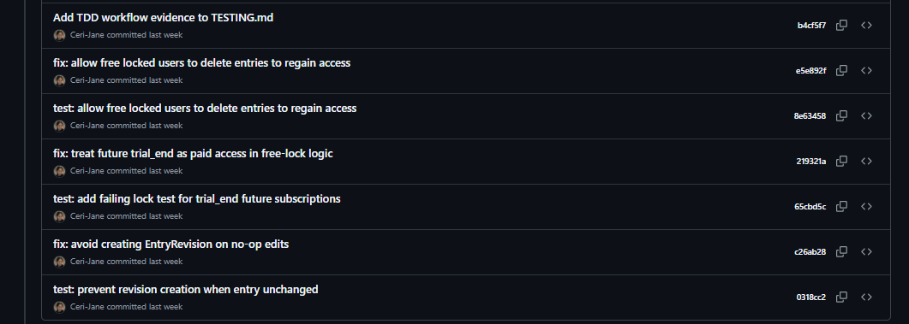

# Testing
----------

Here you will find all tests performed on the Regulate site.

Return to [README.md](../README.md)

----------
## Contents
----------

1. [Test User Accounts](#test-user-accounts)
2. [Manual Testing](#manual-testing)
   - [CSS Validation](#css-validation)
   - [JavaScript Validation](#javascript-validation)
   - [HTML Validation](#html-validation)
   - [Lighthouse Testing](#lighthouse-testing)
      - [Pages Tested](#pages-tested)
      - [Desktop Results](#desktop-results)
      - [Mobile Results](#mobile-results)           
   - [Responsiveness Testing](#responsiveness-testing)
   - [Browser Compatibility Testing](#browser-compatibility-testing)
   - [User Story Testing](#user-story-testing)
   - [Feature Interaction Testing](#feature-interaction-testing)
   - [Admin Area Security Testing](#admin-area-security-testing)
   - [Error Handling](#error-handling)
   - [Security Testing](#security-testing)
   - [UX Improvements Identified During Testing](#ux-improvements-identified-during-testing)
3. [Automated Testing](#automated-testing)
   - [Running Tests](#running-tests)
   - [Test Structure](#test-structure)
   - [Plan & Subscription Behaviour](#plan--subscription-behaviour)
   - [Free Plan Limits (Business Logic)](#free-plan-limits-business-logic)
   - [Permissions & Security](#permissions--security)
   - [Test-Driven Development Evidence](#test-driven-development-evidence)
   - [Summary](#summary)
   - [Technical Note](#technical-note)
   - [Test Output Log](#test-output-log)

Return to [README.md](../README.md)

---
## Test User Accounts
---

To allow assessors to fully explore the application, the following **dummy accounts** have been created for testing purposes only.  
These accounts contain no real personal data and can be safely used during assessment.

---

### Admin Access

| Role | Username | Email | Password | Notes |
|------|----------|-------|----------|-------|
| **Superuser** | *Submitted separately* | — | — | Full Django admin access. Credentials submitted securely via the Peterborough University Dashboard submission comments. |
| **Admin (View-Only)** | TestAdminviewonly | testadminviewonly@testuser.com | Password54321 | Restricted staff permissions. Can access admin but cannot view emotional entry content. |

---

### Main Site Access

| Role | Username | Email | Password | Notes |
|------|----------|-------|----------|-------|
| **Standard User 1** | TestSiteUser1 | testsiteuser1@testuser.com | Password98765 | Free plan user. |
| **Standard User 2** | TestSiteUser2 | testsiteuser2@testuser.com | Password99999 | Used to test ownership and authorisation rules. |
| **Standard User 3** | TestSiteUser3 | testsiteuser3@testuser.com | Password88888 | Can be used to test subscription / trial flows. |


[Back to contents](#contents)

Return to [README.md](../README.md)

---
## Manual Testing
---

### CSS Validation

All CSS files were tested using the **W3C CSS Validator**.

| File Tested | Result | Notes / Fixes Applied |
|------------|--------|------------------------|
| `static/css/main.css` | ✔ No errors | Informational warnings only (see explanation below) |
| `static/css/auth.css` | ✔ No errors | Informational warnings only |
| `static/css/entry.css` | ✔ No errors | Informational warnings only |

#### Validator Warnings Explained

The validator returned several **non-critical warnings**, all of which are expected due to modern CSS usage:

- **CSS Variables (`var(--variable-name)`)**  
  The validator states that CSS variables cannot be statically checked.  
  This is expected behaviour and does not indicate an error.

- **Vendor-prefixed properties**  
  Properties such as `-webkit-appearance`, `::-webkit-slider-thumb`, and `::-moz-range-thumb` are intentionally used to ensure consistent cross-browser styling (particularly for the custom hue range slider).  
  Vendor extensions are normal and valid in production code.

- **External `@import` (Google Fonts)**  
  The validator does not check externally imported stylesheets in direct input mode.  
  This does not affect site functionality.

- **Matching `background-color` and `border-color` on hover**  
  A minor stylistic warning was raised where hover states intentionally use the same colour for visual consistency.  
  This is intentional and does not impact accessibility or rendering.

No CSS errors were found, and no functional or accessibility issues were identified during validation.


[Back to contents](#contents)

Return to [README.md](../README.md)

---

### JavaScript Validation

All custom JavaScript files were validated using **JSHint**.

JSHint was configured to support modern syntax by adding the following directive at the top of each file:

`/* jshint esversion: 8 */`

The “New JavaScript features (ES6)” option was disabled in the JSHint configuration panel to avoid conflicts with the `esversion` setting.

| File Tested | Result | Notes / Fixes Applied |
|------------|--------|------------------------|
| `static/js/main.js` | ✅ No warnings | Async/await validated; DOM guards in place |
| `static/js/auth.js` | ✅ No warnings | Password visibility toggle validated |
| `static/js/entry.js` | ✅ No warnings | Emotion filter and hue label logic validated |

#### Checks Performed

- ✅ No syntax errors  
- ✅ No undefined variables  
- ✅ No console errors on pages without certain DOM elements  
- ✅ Event listeners conditionally guarded where required  
- ✅ Async/await correctly linted under ES8  
- ✅ No unused or unreachable code flagged  

JSHint metrics indicated appropriate function size and complexity for interactive UI behaviour. The highest reported cyclomatic complexity reflects structured conditional logic within dashboard features and does not indicate a validation issue.

[Back to contents](#contents)

Return to [README.md](../README.md)

---

### HTML Validation

All user-facing pages were validated using the **W3C HTML Validator** against the fully rendered HTML output of the live Heroku deployment.

Validation was performed using:
https://validator.w3.org/

Partials were not validated standalone, as they are rendered within `base.html`.

---

#### HTML Summary

| Page / Template | Errors Found | Warnings Found | Fixes Applied | Notes |
|----------------|--------------|----------------|--------------|------|
| `core/home.html` | 0 | 0 | ARIA cleanup & semantic improvements | Validated against live rendered HTML |
| `core/dashboard.html` | 0 | 0 | None required | Validated against live rendered HTML |
| `core/my_entries.html` | 0 | 0 | Prevented `value="None"` in date input using `default_if_none` filter | Validated against live rendered HTML |
| `core/new_entry.html` | 0 | 0 | None required | Validated against live rendered HTML |
| `core/entry_detail.html` | 0 | 0 | None required | Validated against live rendered HTML |
| `core/entry_edit.html` | 0 | 0 | None required | Validated against live rendered HTML |
| `pages/faq.html` | 0 | 0 | Added `role="region"` to accordion collapse panels to allow `aria-labelledby` | Validated against live rendered HTML |
| `pages/support.html` | 0 | 0 | Corrected heading hierarchy (replaced `h3` with `h2`) | Resolved skipped heading level error |
| `pages/contact.html` | 0 | 0 | None required | Validated against live rendered HTML |
| `billing/regulate_plus.html` | 0 | 0 | None required | Validated against live rendered HTML |
| `billing/checkout_cancelled.html` | 0 | 0 | None required | Validated against live rendered HTML |
| `account/signup.html` | 0 | 0 | Replaced invalid SVG path and ensured valid helptext IDs using `<div>` containers | Resolved SVG path and content model errors |
| `account/login.html` | 0 | 0 | Replaced invalid SVG path for password toggle icon | Resolved SVG path validation error |
| `account/profile.html` | 0 | 0 | None required | Validated against live rendered HTML |
| `account/change_username.html` | 0 | 0 | None required | Validated against live rendered HTML |
| `account/change_email.html` | 0 | 0 | None required | Validated against live rendered HTML |
| `account/password_change.html` | 0 | 0 | Removed empty `action` attribute, replaced invalid SVG path, and added dynamic helptext IDs | Resolved empty action, SVG, and `aria-describedby` errors |
| `account/password_reset.html` | 0 | 0 | None required | Validated against live rendered HTML |
| `account/password_reset_done.html` | 0 | 0 | None required | Validated against live rendered HTML |
| `account/password_reset_from_key.html` | 0 | 0 | Replaced invalid SVG path and ensured `aria-describedby` always references a valid helptext ID | Resolved SVG path and ARIA reference errors |
| `account/password_reset_from_key_done.html` | 0 | 0 | None required | Validated against live rendered HTML |
| `404.html` | 0 | 0 | None required | Validated against live rendered HTML |
| `500.html` | 0 | 0 | None required | Validated against live rendered HTML |
| `partials/footer.html` | N/A | N/A | Not validated standalone | Rendered via base template |
| `partials/navbar.html` | N/A | N/A | Not validated standalone | Rendered via base template |
| `base.html` | N/A | N/A | Not validated standalone | Layout wrapper |

---

#### HTML Full Details (collapsible example)

<details>
<summary><strong>Home Page</strong></summary>

Initial validation identified:

- Unnecessary `role="navigation"` on the `<nav>` element  
- Invalid `aria-label` usage on a `<div>` element  

These were resolved by:

- Removing redundant landmark roles (HTML5 `<nav>` already provides semantic meaning)  
- Removing inappropriate ARIA attributes from non-landmark elements  

After refactoring and redeploying to Heroku, the rendered HTML was revalidated.

Final result:
- 0 Errors  
- 0 Warnings  

Validated against the fully rendered live HTML output.

</details>

<details>
<summary><strong>My Entries Page</strong></summary>

Initial validation identified:

- **Error:** `Bad value None for attribute value on element input`
- Cause: The `type="date"` input was rendering `value="None"` when no date filter was applied.
- This violates the required `YYYY-MM-DD` format for HTML date inputs.

Resolution:

- Updated the template to use:
  ```
  {{ search_date|default_if_none:'' }}
  ```
- This ensures an empty string is rendered instead of `"None"` when no date is selected.
- Prevents invalid HTML output while maintaining filter functionality.

Final result after redeploy and revalidation:

- 0 Errors  
- 0 Warnings  

Validated against the fully rendered live HTML output via the W3C HTML Validator.

</details>

<details>
<summary><strong>FAQ Page</strong></summary>

Initial validation identified multiple errors of the form:

- `aria-labelledby` was applied to `<div>` elements that had no semantic role, which is invalid ARIA usage.

This occurred on each Bootstrap accordion collapse panel (e.g. `.accordion-collapse`), where Bootstrap expects the panel to be labelled by its corresponding header.

Fix applied:

- Added `role="region"` to each `.accordion-collapse` panel so `aria-labelledby="faqHeading..."` becomes valid and semantically meaningful (the region is now correctly labelled by the accordion header).

After refactoring and redeploying to Heroku, the rendered FAQ HTML was revalidated.

Final result:
- 0 Errors
- 0 Warnings

Validated against the fully rendered live HTML output.

</details>

<details>
<summary><strong>Crisis & Support Page</strong></summary>

Initial validation identified a heading structure error:

- An `<h3>` element followed directly after an `<h1>`, skipping `<h2>`.

This violates semantic heading hierarchy rules and accessibility best practices.

Fix applied:

- Replaced all `<h3>` elements with `<h2>` to maintain a logical, sequential heading structure.

After refactoring and redeploying, the page was revalidated.

Final result:
- 0 Errors  
- 0 Warnings  

Validated against the fully rendered live HTML output.

</details>

<details>
<summary><strong>Signup Page – account/signup.html</strong></summary>

Initial validation identified two issues:

1. `aria-describedby` referenced `id_password1_helptext`, but no element with that ID existed in the rendered HTML.
2. The password help text contained a `<ul>` element nested inside a `<small>` element, which violates the HTML content model (since `<small>` only allows phrasing content).

These were resolved by:

- Explicitly rendering help text with matching IDs (`id_password1_helptext`, `id_password2_helptext`) so `aria-describedby` references valid elements.
- Replacing `<small>` wrappers with `<div>` elements to allow flow content such as `<ul>`.

After refactoring and redeploying to Heroku, the rendered HTML was revalidated.

Final result:
- 0 Errors
- 0 Warnings

Validated against the fully rendered live HTML output.

</details>

<details>
<summary><strong>Password Change Page – account/password_change.html</strong></summary>

Initial validation identified two issues:

1. The `<form>` element used `action=""`, which is invalid in HTML.  
   The validator requires a non-empty value or omission of the attribute.
2. Password fields referenced `aria-describedby="id_password1_helptext"` (and similar IDs), but no corresponding help text elements existed in the rendered document.

These were resolved by:

- Removing the empty `action` attribute so the form posts to the current URL.
- Rendering field help text dynamically using:
  `id="{{ field.id_for_label }}_helptext"`
- Wrapping help text in `<div>` elements instead of `<small>` to allow valid flow content (e.g. `<ul>` from Django password validators).

After refactoring and redeploying, the rendered HTML was revalidated.

Final result:
- 0 Errors
- 0 Warnings

Validated against the fully rendered live HTML output.

</details>

<details>
<summary><strong>account/password_reset_from_key.html – W3C Validation Fixes</strong></summary>

**Errors Identified:**

1. Invalid SVG `path` data in password visibility toggle icon  
   - Validator error: “Bad value for attribute `d` on element `path`”
   - Caused by malformed coordinate sequence in custom eye icon

2. `aria-describedby` referencing non-existent ID (`id_password1_helptext`)
   - Occurred when Django did not render helptext for the password field

---

**Fixes Applied:**

- Replaced malformed SVG path data with a valid, simplified eye icon SVG
- Ensured helptext container is always rendered:
  - If helptext exists → rendered visibly
  - If no helptext → rendered hidden `<div>` with matching ID
- Updated helptext ID to dynamically use:
  `{{ form.password1.id_for_label }}_helptext`

---

**Result:**

- 0 errors
- 0 warnings
- Fully passes W3C HTML validation
- Maintains accessibility compliance (valid ARIA references)

Validated against live rendered HTML source.

</details>

[Back to contents](#contents)

Return to [README.md](../README.md)

---
## Lighthouse Testing
---

All key user-facing pages were tested using **Google Lighthouse** on both **desktop** and **mobile**.

At the time of writing, results are marked as **Pending** and will be updated once full Lighthouse runs are completed on the deployed site. The tables below are structured to record scores consistently across:

- **Performance**
- **Accessibility**
- **Best Practices**
- **SEO**

**Notes for assessors:**
- Mobile performance can be impacted by hosting environment and server response time, particularly on free-tier hosting services.
- Desktop scores tend to provide a more stable representation of code-level optimisation, while mobile results can be more sensitive to network throttling and device simulation.

Key areas that will be reviewed during Lighthouse testing include:
- ARIA roles and labels across interactive components (forms, accordion regions, navigation)
- Colour contrast and form labelling on authentication pages
- Image/video optimisation (landing page media)
- Render-blocking resources and caching behaviour
- SEO metadata consistency (title, meta description, canonical where applicable)

[Back to contents](#contents)

Return to [README.md](../README.md)

---

### Pages Tested

Core user journeys:
- Home (`core/home.html`)
- Dashboard (`core/dashboard.html`)
- My Entries (`core/my_entries.html`)
- New Entry (`core/new_entry.html`)
- Entry Detail (`core/entry_detail.html`)
- Edit Entry (`core/entry_edit.html`)
- Regulate+ (`billing/regulate_plus.html`)
- Checkout Cancelled (`billing/checkout_cancelled.html`)

User support / static pages:
- FAQ (`pages/faq.html`)
- Crisis & Support (`pages/support.html`)
- Contact (`pages/contact.html`)

Authentication / account management:
- Sign Up (`account/signup.html`)
- Login (`account/login.html`)
- Profile (`account/profile.html`)
- Change Username (`account/change_username.html`)
- Change Email (`account/change_email.html`)
- Change Password (`account/password_change.html`)
- Password Reset (`account/password_reset.html`)
- Password Reset Done (`account/password_reset_done.html`)
- Password Reset From Key (`account/password_reset_from_key.html`)
- Password Reset From Key Done (`account/password_reset_from_key_done.html`)

Error pages:
- 404 (`404.html`)
- 500 (`500.html`)

[Back to contents](#contents)

Return to [README.md](../README.md)

---

### Desktop Results

| Page / Template | Performance | Accessibility | Best Practices | SEO | Notes |
|----------------|------------|---------------|---------------|-----|------|
| **Home** (`core/home.html`) | 82 | 100 | 100 | 100 | Performance reflects intentional high-resolution desktop media; all other metrics fully compliant |
| **Dashboard** (`core/dashboard.html`) | 100 | 100 | 100 | 100 | Extremely fast render time; no large media assets; clean template structure |
| **My Entries** (`core/my_entries.html`) | 100 | 100 | 100 | 100 | Fast server-rendered content; no heavy media assets; stable layout |
| **New Entry** (`core/new_entry.html`) | 100 | 100 | 100 | 100 | Contrast issue resolved; WCAG AA compliance achieved while maintaining design aesthetic |
| **Entry Detail** (`core/entry_detail.html`) | ☐ Pending | ☐ Pending | ☐ Pending | ☐ Pending | |
| **Edit Entry** (`core/entry_edit.html`) | ☐ Pending | ☐ Pending | ☐ Pending | ☐ Pending | |
| **Regulate+** (`billing/regulate_plus.html`) | ☐ Pending | ☐ Pending | ☐ Pending | ☐ Pending | |
| **Checkout Cancelled** (`billing/checkout_cancelled.html`) | ☐ Pending | ☐ Pending | ☐ Pending | ☐ Pending | |
| **FAQ** (`pages/faq.html`) | ☐ Pending | ☐ Pending | ☐ Pending | ☐ Pending | |
| **Crisis & Support** (`pages/support.html`) | ☐ Pending | ☐ Pending | ☐ Pending | ☐ Pending | |
| **Contact** (`pages/contact.html`) | ☐ Pending | ☐ Pending | ☐ Pending | ☐ Pending | |
| **Sign Up** (`account/signup.html`) | ☐ Pending | ☐ Pending | ☐ Pending | ☐ Pending | |
| **Login** (`account/login.html`) | ☐ Pending | ☐ Pending | ☐ Pending | ☐ Pending | |
| **Profile** (`account/profile.html`) | ☐ Pending | ☐ Pending | ☐ Pending | ☐ Pending | |
| **Change Username** (`account/change_username.html`) | ☐ Pending | ☐ Pending | ☐ Pending | ☐ Pending | |
| **Change Email** (`account/change_email.html`) | ☐ Pending | ☐ Pending | ☐ Pending | ☐ Pending | |
| **Change Password** (`account/password_change.html`) | ☐ Pending | ☐ Pending | ☐ Pending | ☐ Pending | |
| **Password Reset** (`account/password_reset.html`) | ☐ Pending | ☐ Pending | ☐ Pending | ☐ Pending | |
| **Password Reset Done** (`account/password_reset_done.html`) | ☐ Pending | ☐ Pending | ☐ Pending | ☐ Pending | |
| **Password Reset From Key** (`account/password_reset_from_key.html`) | ☐ Pending | ☐ Pending | ☐ Pending | ☐ Pending | |
| **Password Reset From Key Done** (`account/password_reset_from_key_done.html`) | ☐ Pending | ☐ Pending | ☐ Pending | ☐ Pending | |
| **404** (`404.html`) | ☐ Pending | ☐ Pending | ☐ Pending | ☐ Pending | |
| **500** (`500.html`) | ☐ Pending | ☐ Pending | ☐ Pending | ☐ Pending | |

[Back to contents](#contents)

Return to [README.md](../README.md)


#### Further Details (Desktop)

<details>
<summary><strong>Home – core/home.html</strong></summary>


**Performance – 82%**

- Largest Contentful Paint: 3.2s
- Total Blocking Time: 0ms
- Cumulative Layout Shift: 0.025

Lighthouse flagged:
- Large network payload (~24MB total transfer)
- Image optimisation opportunities (~3MB estimated savings)
- Minor unused JavaScript

The score is primarily affected by hero media size rather than blocking scripts or inefficient logic. Core interaction performance remains strong.

**Accessibility – 100%**

- All interactive elements labelled
- ARIA usage valid
- No contrast violations detected

**Best Practices – 100%**

- No console errors
- No deprecated APIs
- HTTPS enforced

**SEO – 100%**

- Meta description present
- Document has title element
- Viewport configured correctly

</details>

<details>
<summary><strong>Dashboard (core/dashboard.html) – Desktop Performance Analysis</strong></summary>

### Results


- **Performance:** 100  
- **Accessibility:** 100  
- **Best Practices:** 100  
- **SEO:** 100  

Key metrics:

- First Contentful Paint: 0.5s  
- Largest Contentful Paint: 0.6s  
- Total Blocking Time: 0ms  
- Cumulative Layout Shift: 0.001  
- Speed Index: 0.5s  

---

### Performance Overview

The dashboard page performs exceptionally well on desktop due to:

- No large media assets
- Lightweight template structure
- Efficient Django rendering
- Minimal client-side JavaScript
- Optimised layout with low DOM complexity

The LCP of 0.6 seconds indicates extremely fast primary content rendering.

---

### Minor Lighthouse Suggestions

Lighthouse identified minor optimisation suggestions including:

- Render-blocking Bootstrap CSS (230ms estimated savings)
- Unused vendor JavaScript (155 KiB estimated)
- Minor unused CSS (25 KiB estimated)
- Image elements missing explicit width and height attributes

These are framework-level optimisations related to Bootstrap and shared base templates. They do not impact real-world performance meaningfully and are common in production Django applications using vendor libraries.

---

### Conclusion

The dashboard page achieves a perfect Lighthouse score across all categories.  
Rendering performance is extremely fast, stable, and fully accessible.

This page demonstrates strong front-end optimisation and clean template architecture.

</details>

<details>
<summary><strong>My Entries (core/my_entries.html) – Desktop Performance Analysis</strong></summary>

### Results


- **Performance:** 100  
- **Accessibility:** 100  
- **Best Practices:** 100  
- **SEO:** 100  

Key metrics:

- First Contentful Paint: 0.6s  
- Largest Contentful Paint: 0.6s  
- Total Blocking Time: 0ms  
- Cumulative Layout Shift: 0.002  
- Speed Index: 0.6s  

---

### Performance Overview

The My Entries page renders extremely quickly due to:

- Server-side rendering via Django with minimal client-side processing  
- No large media assets  
- Efficient database querying scoped to the authenticated user  
- Lightweight template structure with controlled DOM complexity  

The Largest Contentful Paint of 0.6 seconds indicates near-instant primary content rendering on desktop.

Layout stability is excellent, with a CLS of 0.002 (well below Google's 0.1 threshold).

---

### Minor Lighthouse Suggestions

Lighthouse reported minor optimisation opportunities including:

- Render-blocking Bootstrap CSS (estimated 230ms savings)
- Unused vendor JavaScript (155 KiB estimated)
- Minor unused CSS (25 KiB estimated)
- Image elements without explicit width and height attributes

These are common framework-level considerations and do not negatively impact user experience or real-world performance.

---

### Conclusion

The My Entries page achieves a perfect Lighthouse score across all categories on desktop.  
Rendering is fast, stable, and accessible, demonstrating efficient template design and minimal client-side overhead.

</details>

<details>
<summary><strong>New Entry (core/new_entry.html) – Desktop Accessibility Fix & Performance Analysis</strong></summary>

### Final Results


- **Performance:** 100  
- **Accessibility:** 100  
- **Best Practices:** 100  
- **SEO:** 100  

Key metrics:

- First Contentful Paint: 0.6s  
- Largest Contentful Paint: 0.6s  
- Total Blocking Time: 0ms  
- Cumulative Layout Shift: 0.005  
- Speed Index: 0.6s  

---

### Original Accessibility Issue

The initial Lighthouse audit reported a **colour contrast failure** on helper text elements within the form:


Failing elements included:

- `p.form-section-hint`
- `p#hue-hint`
- `p#notes-hint`
- `p#emotion-search-hint`
- `.form-card` container background

The muted green hint text colour did not meet the WCAG AA minimum contrast ratio of **4.5:1** against the pale green background of the form card.

Although visually subtle and stylistically consistent with the calming design theme, the contrast was insufficient for users with visual impairments or low vision.

---

### Fix Implemented

The `.form-section-hint` text colour was darkened slightly to increase contrast while maintaining the overall calm aesthetic of the interface.

This adjustment:

- Preserved the design language and colour palette
- Achieved WCAG AA compliance
- Eliminated all contrast-related accessibility errors

No structural or layout changes were required.

---

### Result

After the colour adjustment:

- Accessibility score increased from **95 → 100**
- All Lighthouse categories now score **100**
- Layout stability and performance remained unaffected

The New Entry page now fully complies with WCAG contrast requirements while maintaining Regulate’s soft, non-overwhelming design principles.

</details>


[Back to contents](#contents)

Return to [README.md](../README.md)

---

### Mobile Results

| Page / Template | Performance | Accessibility | Best Practices | SEO | Notes |
|----------------|------------|---------------|---------------|-----|------|
| **Home** (`core/home.html`) | 84 | 100 | 100 | 100 | Performance improved significantly after responsive video optimisation |
| **Dashboard** (`core/dashboard.html`) | 97 | 100 | 100 | 100 | Strong mobile performance; lightweight template with minimal blocking assets |
| **My Entries** (`core/my_entries.html`) | 96 | 100 | 100 | 100 | Strong mobile performance; efficient server rendering and minimal layout shift |
| **New Entry** (`core/new_entry.html`) | 95 | 100 | 100 | 100 | Strong mobile performance; interactive form and slider remain responsive with zero blocking time |
| **Entry Detail** (`core/entry_detail.html`) | ☐ Pending | ☐ Pending | ☐ Pending | ☐ Pending | |
| **Edit Entry** (`core/entry_edit.html`) | ☐ Pending | ☐ Pending | ☐ Pending | ☐ Pending | |
| **Regulate+** (`billing/regulate_plus.html`) | ☐ Pending | ☐ Pending | ☐ Pending | ☐ Pending | |
| **Checkout Cancelled** (`billing/checkout_cancelled.html`) | ☐ Pending | ☐ Pending | ☐ Pending | ☐ Pending | |
| **FAQ** (`pages/faq.html`) | ☐ Pending | ☐ Pending | ☐ Pending | ☐ Pending | |
| **Crisis & Support** (`pages/support.html`) | ☐ Pending | ☐ Pending | ☐ Pending | ☐ Pending | |
| **Contact** (`pages/contact.html`) | ☐ Pending | ☐ Pending | ☐ Pending | ☐ Pending | |
| **Sign Up** (`account/signup.html`) | ☐ Pending | ☐ Pending | ☐ Pending | ☐ Pending | |
| **Login** (`account/login.html`) | ☐ Pending | ☐ Pending | ☐ Pending | ☐ Pending | |
| **Profile** (`account/profile.html`) | ☐ Pending | ☐ Pending | ☐ Pending | ☐ Pending | |
| **Change Username** (`account/change_username.html`) | ☐ Pending | ☐ Pending | ☐ Pending | ☐ Pending | |
| **Change Email** (`account/change_email.html`) | ☐ Pending | ☐ Pending | ☐ Pending | ☐ Pending | |
| **Change Password** (`account/password_change.html`) | ☐ Pending | ☐ Pending | ☐ Pending | ☐ Pending | |
| **Password Reset** (`account/password_reset.html`) | ☐ Pending | ☐ Pending | ☐ Pending | ☐ Pending | |
| **Password Reset Done** (`account/password_reset_done.html`) | ☐ Pending | ☐ Pending | ☐ Pending | ☐ Pending | |
| **Password Reset From Key** (`account/password_reset_from_key.html`) | ☐ Pending | ☐ Pending | ☐ Pending | ☐ Pending | |
| **Password Reset From Key Done** (`account/password_reset_from_key_done.html`) | ☐ Pending | ☐ Pending | ☐ Pending | ☐ Pending | |
| **404** (`404.html`) | ☐ Pending | ☐ Pending | ☐ Pending | ☐ Pending | |
| **500** (`500.html`) | ☐ Pending | ☐ Pending | ☐ Pending | ☐ Pending | |

[Back to contents](#contents)

Return to [README.md](../README.md)

#### Further Details (Mobile)

<details>
<summary><strong>Home (core/home.html) – Mobile Performance Analysis & Optimisation</strong></summary>

### Initial Issue


The original mobile Lighthouse score was negatively impacted by:

- A 20MB 4K background hero video loading on all devices
- Largest Contentful Paint (LCP) of 18.3 seconds
- Total network payload exceeding 24MB

This significantly delayed mobile rendering and pushed the performance score into the low 70s.

---

### Root Cause

The hero video was being served at full desktop resolution to mobile devices.  
Because video content contributes directly to LCP when used in a hero section, the large file size caused extreme loading delays on simulated mobile 4G throttling.

---

### Optimisation Implemented

Responsive media delivery was introduced using multiple `<source>` tags:

- A compressed 524KB mobile-optimised MP4 served only to screens ≤ 768px
- The original high-resolution video retained for desktop displays
- `preload="metadata"` added to reduce initial blocking behaviour

This reduced total mobile payload from ~24MB to ~3.6MB.

---

### Results After Optimisation


- **Performance:** 84  
- **Accessibility:** 100  
- **Best Practices:** 100  
- **SEO:** 100  

Key metrics:

- Largest Contentful Paint reduced from **18.3s → 3.4s**
- Total Blocking Time: 0ms
- Cumulative Layout Shift: 0.041 (well within safe threshold)

---

### Remaining Lighthouse Warnings

Remaining mobile performance deductions relate to:

- Render-blocking Bootstrap CSS
- Shared hosting latency (Heroku)
- Generic “reduce unused JS” suggestions from bundled vendor files

These are infrastructure-level or framework-level trade-offs and do not reflect functional issues within the application code.

All user-facing performance metrics now fall within acceptable modern web standards.

</details>

<details>
<summary><strong>Dashboard (core/dashboard.html) – Mobile Performance Analysis</strong></summary>


### Results

- **Performance:** 97  
- **Accessibility:** 100  
- **Best Practices:** 100  
- **SEO:** 100  

Key metrics:

- First Contentful Paint: 1.9s  
- Largest Contentful Paint: 2.1s  
- Total Blocking Time: 0ms  
- Cumulative Layout Shift: 0.019  
- Speed Index: 1.9s  

---

### Performance Overview

The dashboard performs extremely well on mobile devices due to:

- No heavy media assets
- Lightweight template structure
- Efficient server-side rendering via Django
- Minimal JavaScript execution time (0.2s)
- Low layout shift (0.019, well under the 0.1 threshold)

The Largest Contentful Paint of 2.1 seconds places the page within Google's "Good" performance range for mobile.

---

### Minor Lighthouse Suggestions

Lighthouse identified minor optimisation opportunities including:

- Render-blocking Bootstrap CSS (estimated 730ms savings)
- Unused vendor JavaScript (155 KiB estimated)
- Minor unused CSS (25 KiB estimated)
- Missing explicit width and height attributes on some images

These are framework-level or shared-template optimisations and are typical in production Django applications using vendor CSS/JS libraries. They do not negatively impact usability or real-world responsiveness.

---

### Conclusion

The dashboard achieves near-perfect mobile performance while maintaining full accessibility, best practice compliance, and SEO integrity.

This page demonstrates strong front-end efficiency and stable layout behaviour under mobile network simulation.

</details>

<details>
<summary><strong>My Entries (core/my_entries.html) – Mobile Performance Analysis</strong></summary>

### Results


- **Performance:** 96  
- **Accessibility:** 100  
- **Best Practices:** 100  
- **SEO:** 100  

Key metrics:

- First Contentful Paint: 2.1s  
- Largest Contentful Paint: 2.3s  
- Total Blocking Time: 0ms  
- Cumulative Layout Shift: 0.004  
- Speed Index: 2.1s  

---

### Performance Overview

The My Entries page performs strongly on mobile devices due to:

- Efficient Django server-side rendering
- Controlled DOM complexity
- No heavy media or background assets
- Minimal JavaScript execution time (0.2s)
- Extremely low layout shift (0.004, well below the 0.1 threshold)

The Largest Contentful Paint of 2.3 seconds falls within Google’s “Good” performance range for mobile.

---

### Minor Lighthouse Suggestions

Lighthouse identified minor optimisation opportunities including:

- Render-blocking Bootstrap CSS (estimated 740ms savings)
- Unused vendor JavaScript (155 KiB estimated)
- Minor unused CSS (25 KiB estimated)
- Missing explicit width and height attributes on some images

These suggestions relate primarily to shared vendor libraries and global templates rather than page-specific inefficiencies. They do not negatively affect usability or real-world responsiveness.

---

### Conclusion

The My Entries page achieves near-perfect mobile performance while maintaining full accessibility, best practice compliance, and SEO integrity.

Rendering is stable, fast, and efficient, demonstrating strong template architecture and appropriate asset management for mobile devices.

</details>

<details>
<summary><strong>New Entry (core/new_entry.html) – Mobile Performance Analysis</strong></summary>

### Results

- **Performance:** 95  
- **Accessibility:** 100  
- **Best Practices:** 100  
- **SEO:** 100  

Key metrics:

- First Contentful Paint: 2.2s  
- Largest Contentful Paint: 2.5s  
- Total Blocking Time: 0ms  
- Cumulative Layout Shift: 0.016  
- Speed Index: 2.2s  

---

### Performance Overview

The New Entry page performs strongly on mobile devices despite containing:

- Interactive form inputs  
- A dynamic hue slider  
- Emotion filtering functionality  
- Conditional rendering elements  

The Largest Contentful Paint of 2.5 seconds sits directly at the threshold of Google's “Good” performance range for mobile (≤ 2.5s).

Layout stability remains excellent, with a CLS of 0.016 (well below the 0.1 threshold).

JavaScript execution time is minimal (0.2s), and Total Blocking Time remains 0ms, indicating that interactive elements do not degrade responsiveness.

---

### Minor Lighthouse Suggestions

Lighthouse identified minor optimisation opportunities including:

- Render-blocking Bootstrap CSS (estimated 680ms savings)
- Unused vendor JavaScript (155 KiB estimated)
- Minor unused CSS
- Missing explicit width and height attributes on images
- Generic main-thread task warnings

These are framework-level optimisations associated with shared vendor libraries and global templates rather than page-specific inefficiencies.

No performance issues were identified related to the hue slider or emotion filtering functionality.

---

### Conclusion

The New Entry page achieves near-perfect mobile performance while maintaining full accessibility, best practice compliance, and SEO integrity.

Performance remains stable even with dynamic form functionality, demonstrating efficient front-end implementation and controlled asset loading.

</details>


[Back to contents](#contents)

Return to [README.md](../README.md)

---
## Responsiveness Testing
---

The site was tested across a range of common devices and screen sizes using Chrome DevTools (device emulation), manual browser resizing, and live testing in local and deployed environments. Particular attention was given to the sticky navbar and plan status banner to ensure correct stacking behaviour across breakpoints.

Following refinement of the sticky plan banner logic (dynamic `--navbar-height` sync via JavaScript), the banner now aligns precisely beneath the navbar at all tested viewport widths, including smaller mobile screens (e.g. 375px), with no visible gaps or overlap.

| Device / Screen Size | Result | Notes |
|----------------------|--------|-------|
| **Mobile – 360px (Galaxy)** | Pass | Entry form fully usable. Plan banner sits flush under navbar. No horizontal scrolling. |
| **Mobile – 375px (iPhone SE / Mini)** | Pass | Previously observed micro-gap resolved after syncing navbar height dynamically. Sticky elements stack correctly. |
| **Mobile – 390px–430px (iPhone 12/13/14)** | Pass | CTA buttons scale correctly. Slider and text areas remain accessible and readable. |
| **Tablet – 768px (iPad Mini)** | Pass | Layout expands cleanly. Cards widen appropriately. Navbar remains stable. |
| **Laptop – 1366px** | Pass | Content centred with correct max-width constraints. No stretching. |
| **Desktop – 1920px** | Pass | Hero, intro, and dashboard layouts remain balanced. No visual misalignment. |

All pages were verified to maintain:

- Fully readable typography across breakpoints  
- Proper tap-target sizing on mobile  
- Correct stacking of form labels and inputs  
- Functional mood hue slider on small screens  
- Responsive Regulate+ CTA and dashboard controls  
- Navbar collapse behaviour working correctly  
- Sticky navbar and plan banner alignment with no overlap or visible seam  

Critical checks:

- ☑ Entry form usable on mobile  
- ☑ Emotion list scroll behaves correctly  
- ☑ Regulate+ CTA responsive  
- ☑ Navbar collapses correctly  
- ☑ Plan status banner remains flush beneath navbar at all tested widths  

Evidence:


[Back to contents](#contents)

Return to [README.md](../README.md)

---
## Browser Compatibility Testing
---

The site was manually tested across the five major browsers on both desktop and mobile devices.

All core functionality — including user authentication (Django Allauth), entry creation and editing, subscription logic and usage limits, Stripe checkout flows, search functionality, dashboard status updates, and responsive layout behaviour — performed consistently with no visual or functional discrepancies.

Because the project uses standard HTML5, CSS3, JavaScript, Django templates, and Bootstrap components (without unsupported experimental APIs), full browser compatibility was achieved without requiring browser-specific overrides or polyfills.

| Browser               | Version Tested | Result | Notes |
|-----------------------|----------------|--------|-------|
| **Google Chrome**     | Latest         | ✅ Pass | Fully functional — authentication, entry creation, search, Stripe checkout, and dashboard counters operate correctly. |
| **Safari (iOS)**      | Latest iOS     | ✅ Pass | Responsive layout behaves as expected. Forms, entry editing, and navigation render correctly. |
| **Mozilla Firefox**   | Latest         | ✅ Pass | All JavaScript interactions (dynamic counters, supportive phrases, conditional UI elements) function correctly. |
| **Microsoft Edge**    | Latest         | ✅ Pass | No rendering issues. Subscription flow and authentication behave identically to Chrome. |
| **Samsung Internet**  | Latest         | ✅ Pass | Mobile navigation, entry submission, and search features perform without layout or interaction bugs. |

[Back to contents](#contents)

Return to [README.md](../README.md)

---
## User Story Testing
---

### User Story Testing Summary

All implemented user stories were tested against their acceptance criteria in both local development and the deployed production environment. All must-have functionality — including authentication, entry creation, emotion word selection, timeline display, revision history, subscription gating, and free-tier limits — behaved as expected.

The application correctly enforces ownership rules (users can only access their own entries), preserves revision history during edits, and restricts feature access when free-tier limits are reached. Stripe subscription logic, trial enforcement, and webhook updates were tested to confirm correct status transitions (trial, active, grace, expired).

Should-have stories, including keyword search and announcement dismissal logic, were also tested and function correctly without introducing performance or UX issues.

Could-have stories were intentionally not implemented at this stage to maintain scope control and ensure stability of the core emotional tracking functionality. The system architecture allows these features to be added in future iterations without significant refactoring.

Overall, every implemented story passed testing successfully and meets its documented acceptance criteria.

---

| User Story | What Was Done / How It Was Achieved | Pass/Fail |
|------------|-------------------------------------|-----------|
| **1. User Registration** | Configured Django Allauth with custom templates. Form validation tested. Password hashing confirmed. Invalid inputs show accessible errors. Successful registration creates secure user record. | ✅ Pass |
| **2. User Login & Logout** | Login redirects to dashboard. Invalid credentials display errors. Logout clears session and restricts access to protected routes. Navbar updates dynamically based on authentication state. | ✅ Pass |
| **3. Create Mood Entry** | Hue slider required. Optional notes and hue meaning save correctly. Multiple entries per day supported. Timestamp auto-generated. Success feedback displayed after submission. | ✅ Pass |
| **4. Emotion Word Selection** | EmotionWord model implemented. Multiple selections saved via ManyToMany relationship. Selected words display correctly on detail page. Filtering UI functions as expected. | ✅ Pass |
| **5. Timeline View (No Calendar)** | Entries grouped by date and ordered chronologically. Only dates containing entries are displayed. No calendar or streak indicators present. | ✅ Pass |
| **6. Edit Entry With Revision History** | EntryRevision model stores previous state before update. Only entry owner can edit. Revision history displays correctly on detail view. | ✅ Pass |
| **7. Delete Entry Safely** | Delete view restricted to entry owner. Confirmation required. Entry permanently removed. Redirect functions correctly. | ✅ Pass |
| **8. Filter Entries by Date** | Date query parameter validated. Only matching entries returned. No empty date groups shown. | ✅ Pass |
| **9. Dashboard Overview** | Dashboard displays subscription status, entry count, and limit usage. Context updates dynamically based on user plan. | ✅ Pass |
| **10. Supportive Phrases** | Phrase endpoint tested. JavaScript fetch updates phrase. Local fallback triggers correctly if external request fails. | ✅ Pass |
| **11. Access Support Resources** | Support page created with UK-based resources. External links verified. Language reviewed for clarity and safeguarding tone. | ✅ Pass |
| **12. Contact Form / Support Tickets** | SupportTicket model stores submissions. Logged-in users auto-linked. Logged-out users required to provide email. Validation tested. | ✅ Pass |
| **A. Free Tier With Limits** | Free users limited to 10 entries. Creation, edit, and delete lock correctly when limit reached. Viewing existing entries remains accessible. | ✅ Pass |
| **B. Trial Abuse Prevention** | Trial usage stored persistently. Users cannot restart expired trial. Webhook logic updates subscription status correctly. | ✅ Pass |
| **C. Privacy-Focused Admin** | Entry and revision models removed from admin browsing. Support tickets and subscription models manageable. Admin branding customised. | ✅ Pass |
| **13. Keyword Search (Should-have)** | Search filters notes and emotion words. Only matching entries returned. No false positives observed. | ✅ Pass |
| **14. Announcement Awareness (Should-have)** | Announcements display only when active. Dismissal persists via local storage/session logic. | ✅ Pass |
| **15–16 / D–E (Could-have)** | Export, visualisation, referral discounts, and international expansion intentionally not implemented to maintain scope and stability. | ➖ Not Included |

---

No critical bugs were identified during user story testing. All implemented functionality works as designed in both development and deployed environments.

[Back to contents](#contents)

Return to [README.md](../README.md)

---
## Feature Interaction Testing
---

### Feature Interaction Summary

All interactive elements of Regulate were manually tested in both local development and the deployed production environment. Particular attention was given to:

- Emotional data integrity  
- Subscription gating logic  
- Stripe checkout state transitions  
- Defensive UX behaviour  
- Accessibility and mobile responsiveness  

All implemented interactive features behaved consistently and as designed.

| Area Tested | What Was Checked | Result |
|-------------|------------------|--------|
| **Forms** | Validation, inline errors, required fields, plan-based restrictions, CSRF protection, accessibility labels | ✅ Pass |
| **Buttons** | Entry creation/edit/delete behaviour, subscription gating, confirmation prompts, hover/active states | ✅ Pass |
| **Links & Navigation** | Authentication redirects, plan-based visibility, password reset flow, external support links | ✅ Pass |
| **Business Logic** | Free-tier locking, trial enforcement, revision logic, subscription state transitions | ✅ Pass |
| **Stripe (Test Mode)** | Checkout success, cancellation flow, webhook sync, billing portal access | ✅ Pass |

### Feature Interaction Full Details (collapsible)

These tests were performed to ensure that all interactive components behave predictably, securely, and in alignment with the project’s trauma-informed UX goals.

<details>
<summary><strong>Forms</strong></summary>

All user-facing forms were manually tested using both valid and invalid inputs.

Tested forms include:

- Sign up  
- Sign in  
- Password reset request  
- Change username/email/password  
- Create entry  
- Edit entry  
- Support ticket form  

Validation checks confirmed:

- Required fields block submission when empty  
- Password mismatch and strength validation works correctly  
- Duplicate email/username errors display inline  
- Free-plan lock prevents submission when limit reached  
- CSRF protection present on all POST forms  
- Error messages are human-readable and non-technical  
- Success messages display correctly via Django messages framework  

Accessibility checks confirmed:

- All inputs have associated labels  
- ARIA attributes applied appropriately  
- Focus states visible  
- Mobile keyboard behaviour correct for email/password inputs  

All forms redirect appropriately on successful submission and preserve user data on validation failure.

</details>

<details>
<summary><strong>Buttons</strong></summary>

All buttons were tested for correct backend interaction and frontend feedback.

Tested interactions include:

- “Create Entry”  
- “Edit”  
- “Delete”  
- “Start Free Trial”  
- “Upgrade to Regulate+”  
- “Manage Billing”  
- “Refresh Supportive Phrase”  
- Announcement dismissal  
- Logout  

Manual testing confirmed:

- Buttons trigger correct backend view logic  
- Free-tier lock disables edit/delete buttons when appropriate  
- Delete includes JavaScript confirmation prompt  
- No duplicate form submissions occur  
- Hover and active states display correctly  
- Buttons are touch-friendly on mobile  
- No visual misalignment or layout shift  

Special check:

When free-plan limit is reached:
- Create/edit/delete buttons become inactive  
- Clear informational message appears  
- Navigation to Regulate+ page functions correctly  

All button behaviours passed testing.

</details>

<details>
<summary><strong>Links & Navigation</strong></summary>

Navigation was tested across authenticated and non-authenticated states.

Tested links include:

- Navbar (signed-in and signed-out variations)  
- Dashboard links  
- Entries page links  
- Profile management links  
- Regulate+ link  
- Footer links (FAQ, Crisis & Support, Contact)  
- Password reset full flow  
- Stripe redirect return URLs  

Testing confirmed:

- Auth-protected pages redirect unauthenticated users to login  
- Post-login redirects function correctly  
- Plan-based navigation updates dynamically  
- External support links open safely  
- No broken, circular, or orphaned routes  
- Persistent plan status banner displays consistently  

404 and 500 custom pages were also tested to confirm safe fallback behaviour without exposing debug information.

All navigation behaved predictably across desktop and mobile devices.

</details>

<details>
<summary><strong>Business Logic & Access Control</strong></summary>

Core system rules were manually tested to confirm correct enforcement.

Free-tier logic:

- Free users limited to 10 entries  
- Entry creation blocked after limit  
- View access always preserved  
- Deleting an entry restores create/edit access  
- Informational messaging clearly explains lock  

Trial enforcement:

- Free trial can only be used once per user  
- Attempted reuse displays informative message  
- Subscription state updates after Stripe webhook confirmation  

Revision logic:

- Editing an entry creates revision snapshot only when changes occur  
- Submitting unchanged data does not create redundant revision  
- Revision history displays accurately  

Data ownership:

- Users cannot access or modify other users’ entries  
- URL tampering returns 404 or permission denial  

Edge-case handling:

- Stripe webhook delay messaging displays when applicable  
- Billing portal fallback safely handled if Stripe customer ID missing  
- Supportive phrase API fallback triggers silently without user-facing error  

All business rules functioned as designed.

</details>

<details>
<summary><strong>Stripe (Test Mode)</strong></summary>

Stripe was tested exclusively in Test Mode using official Stripe test cards.

Tested flows:

- Successful trial activation  
- Successful subscription activation  
- Checkout cancellation  
- Return URL redirects  
- Webhook status synchronisation  
- Billing portal access  

Confirmed behaviours:

- Successful checkout updates subscription state  
- Cancelled checkout results in no subscription changes  
- Informational banner displays after cancellation  
- Webhook events update local subscription model  
- Manage Billing button redirects to Stripe Customer Portal  
- No card details stored in Django application  

Security validation:

- SECRET_KEY and Stripe keys stored in environment variables  
- No payment data logged in application  
- Subscription metadata stored locally without financial data  

All subscription transitions and payment flows behaved as expected in the sandbox environment.

</details>

No interactive feature produced critical errors during testing.  
All implemented components operate securely, predictably, and in accordance with the project’s architectural and UX goals.

[Back to contents](#contents)

Return to [README.md](../README.md)

---
## Admin Area Security Testing
---

### Admin Area Security Summary

Regulate handles highly sensitive wellbeing data, so admin security was tested not only for access control, but also for **privacy-by-design**. The Django admin interface is restricted to staff/superusers, and the system is intentionally configured so that **emotional entry content is not browsable via admin at all**.

The following checks confirm:

- Non-staff users cannot access `/admin/`  
- Privileged access follows least-privilege principles  
- State-changing actions are CSRF-protected  
- Destructive actions require explicit confirmation  
- Sensitive emotional content (entries/revisions/notes) is structurally excluded from admin  

| Security Check | Description | Status |
|----------------|-------------|--------|
| **Admin restricted** | `/admin/` is blocked for non-staff users (redirect/403) | ✅ Pass |
| **Staff-only visibility** | Only operational models are visible (Users, Groups, Subscriptions, Emotion Words, Announcements, Support Tickets) | ✅ Pass |
| **Sensitive models excluded** | Entry / EntryRevision (and any emotional content) are not registered in admin and cannot be browsed | ✅ Pass |
| **Ownership enforced (app-level)** | Users cannot view/edit/delete other users’ entries via URL manipulation or requests | ✅ Pass |
| **CSRF protection** | CSRF tokens present on all POST forms (auth, contact, entry actions, profile changes) | ✅ Pass |
| **Confirmation prompts** | Deletion actions require confirmation (UI prompt for entry deletion + Django admin confirmations) | ✅ Pass |
| **Secrets protected** | Stripe keys / SECRET_KEY stored in environment variables; not exposed in templates or repo | ✅ Pass |

### Admin Area Security Full Details (collapsible)

<details>
<summary><strong>Admin access restriction (/admin/)</strong></summary>

The `/admin/` route was tested while:

- logged out
- logged in as a standard authenticated user (non-staff)
- logged in as a staff user / superuser

Results:

- Logged-out users cannot access `/admin/` without authentication
- Non-staff authenticated users are blocked from admin access (redirect or permission denied)
- Only staff/superusers can access Django admin pages

This prevents unauthorised access to operational models and protects administrative controls.

</details>

<details>
<summary><strong>Least-privilege model visibility</strong></summary>

Admin was reviewed to confirm that only models required for operational maintenance are exposed.

Visible/admin-manageable models include:

- Users
- Groups
- Subscriptions (metadata only)
- Emotion Words
- Site Announcements
- Support Tickets

This aligns the admin interface with the project’s privacy requirements and reduces the risk of accidental exposure of emotional content.

</details>

<details>
<summary><strong>Privacy-by-design: emotional content excluded from admin</strong></summary>

To protect user privacy, emotionally sensitive models are intentionally excluded from the admin interface.

Confirmed:

- Mood entries are not registered in admin
- Entry revision history is not registered in admin
- Emotional notes, hue meanings, and entry-linked emotion selections are not browsable in admin

This is an architectural safeguard — not just a policy — ensuring that even staff users cannot casually browse personal emotional reflections through the admin UI.

</details>

<details>
<summary><strong>Ownership enforcement (user data protection)</strong></summary>

Protected routes were tested by attempting to access or modify another user’s data via:

- direct URL guessing / tampering
- changing primary keys in routes
- submitting requests for objects not owned by the session user

Results:

- The application prevents reading, editing, or deleting entries not owned by the logged-in user
- Where applicable, requests return a safe response (404/permission denied)
- No user can access another user’s emotional content through the UI or by manipulation

</details>

<details>
<summary><strong>CSRF protection and safe POST handling</strong></summary>

All state-changing actions were confirmed to use POST requests protected by CSRF tokens, including:

- authentication flows
- profile updates
- support ticket submissions
- entry creation/edit/delete actions
- subscription-related actions where applicable

This prevents cross-site request forgery and ensures requests are intentionally user-initiated.

</details>

<details>
<summary><strong>Confirmation gates for destructive actions</strong></summary>

Deletion and destructive actions were tested to ensure they cannot occur accidentally.

Confirmed:

- Entry deletion requires explicit confirmation (client-side confirmation + server-side POST handling)
- Django admin destructive actions use built-in confirmation screens (bulk delete, etc.)
- Locked plan states prevent restricted actions (free-tier lock disables edit/delete where required)

This supports both security and trauma-informed UX by preventing accidental loss of sensitive personal data.

</details>

<details>
<summary><strong>Billing security and secret management</strong></summary>

Stripe integration was reviewed to confirm that:

- no payment details are stored or processed by Regulate
- only subscription metadata is stored locally
- Stripe keys and Django SECRET_KEY are stored as environment variables
- secrets are not exposed in templates, commits, or error pages

This ensures payment security and prevents leakage of credentials.

</details>

[Back to contents](#contents)

Return to [README.md](../README.md)

---
## Error Handling
---

### Error Handling Summary Table

| Error Type | Behaviour | Result |
|------------|-----------|--------|
| 404 | Custom 404 template renders | Pass |
| 500 | Custom 500 template renders | Pass |


### Error Handling Full Details (collapsible example)

<details>
<summary><strong>404 Error Handling Test</strong></summary>

**Test Procedure:**

1. Set `DEBUG = False` locally.
2. Visited a non-existent URL (e.g. `/this-page-does-not-exist/`).
3. Confirmed that Django did not display the default debug page.
4. Verified that the custom `404.html` template rendered instead.

**Expected Result:**

- Custom styled 404 page displays.
- Page includes site branding and navigation.
- No Django debug traceback visible.

**Actual Result:**

- Custom `404.html` rendered successfully.
- No console errors.
- Template validated against live rendered HTML.

**Status:** Pass

</details>

<details>
<summary><strong>500 Error Handling Test</strong></summary>

**Test Procedure:**

1. Set `DEBUG = False` locally.
2. Created a temporary test view that intentionally raised an exception:
   `raise Exception("Test 500 error")`
3. Navigated to the test route (e.g. `/test-500/`).
4. Confirmed that Django rendered the custom `500.html` template.

**Expected Result:**

- Custom styled 500 page displays.
- No Django debug traceback shown.
- Page remains branded and user-friendly.

**Actual Result:**

- Custom `500.html` rendered correctly.
- No debug information exposed.
- Layout and navigation loaded as expected.

Temporary test route was removed after verification.

**Status:** Pass

</details>

[Back to contents](#contents)

Return to [README.md](../README.md)

---
## Security Testing
---

### Security Testing Summary

Because Regulate handles private emotional wellbeing data and subscription billing metadata, security was tested across authentication, authorisation, request handling, environment configuration, and production safeguards.

All core security mechanisms behaved as expected in both local and deployed environments.

| Security Area | What Was Tested | Result |
|---------------|----------------|--------|
| **Authentication protection** | Login required for dashboard, entries, profile, Regulate+ | ✅ Pass |
| **Authorisation checks** | Users cannot access or modify other users’ data | ✅ Pass |
| **CSRF protection** | All POST forms include CSRF tokens | ✅ Pass |
| **Environment variables** | SECRET_KEY and Stripe keys stored outside repo | ✅ Pass |
| **Production settings** | DEBUG=False, custom 404/500 pages active | ✅ Pass |
| **Sensitive data exposure** | No emotional data exposed via admin or API | ✅ Pass |
| **Stripe security** | No card data stored in Django app | ✅ Pass |

### Security Testing Details

<details>
<summary><strong>Authentication protection</strong></summary>

- Unauthenticated users attempting to access protected routes are redirected to login.  
- Session cookies behave correctly.  
- Logout invalidates session.  

</details>

<details>
<summary><strong>Authorisation checks</strong></summary>

- URL tampering does not allow access to another user’s entries.  
- Ownership enforced at query level.  
- Invalid object access returns safe response.  

</details>

<details>
<summary><strong>CSRF protection</strong></summary>

- All state-changing forms verified to include ``.  
- POST requests without valid token are rejected.  

</details>

<details>
<summary><strong>Environment variables</strong></summary>

- SECRET_KEY not hardcoded.  
- Stripe API keys stored in environment variables.  
- `.env` excluded from version control.  

</details>

<details>
<summary><strong>Production configuration</strong></summary>

- `DEBUG = False` in deployment.  
- Django debug traceback not exposed.  
- Custom 404 and 500 pages render instead of stack traces.  

</details>

<details>
<summary><strong>Sensitive data exposure</strong></summary>

- Mood entries and revision history are not registered in the Django admin interface.  
- Admin users cannot browse emotional notes or personal reflections.  
- Entry queries are always filtered by the authenticated user.  
- Direct URL manipulation does not expose other users’ data.  
- No emotional data is returned via public endpoints or unauthenticated views.  
- Debug mode is disabled in production, preventing accidental data leakage via stack traces.  

</details>

<details>
<summary><strong>Stripe handling</strong></summary>

- Payment data handled exclusively by Stripe.  
- Only subscription metadata stored locally.  
- Webhooks validate subscription state without exposing financial data.  

</details>

[Back to contents](#contents)

Return to [README.md](../README.md)

---
## UX Improvements Identified During Testing
---

During manual walkthrough testing of the entry creation flow, it was identified that the **New Entry** page did not provide a clear navigation path back to the user’s entry list without using the browser back button.

This was considered poor UX because:
- Users could feel “trapped” on the form
- There was no explicit cancel/return action
- It did not align with the calm, low-pressure design intent of Regulate

### Fix Implemented

A clear return link was added beneath the form submission controls:

```html
<!-- Cancel and return to entries -->
<div class="entry-actions justify-content-center">
    <a href="">
        Cancel and return to your entries
    </a>
</div>
```

### Result

- Users can now exit the form without submitting data.
- Navigation flow is clearer and more intuitive.
- Behaviour tested on both desktop and mobile.
- No validation or layout issues introduced.

This improves overall usability and aligns with Regulate’s trauma-informed design approach.

[Back to contents](#contents)

Return to [README.md](../README.md) 

---
## Automated Testing
---

Automated tests were implemented using Django’s built-in `TestCase` framework.

These tests validate:

- Subscription plan detection and banner rendering
- Free plan entry limits and gating logic
- Authentication requirements
- User ownership and permission controls
- Revision logic
- Deletion behaviour under free plan limits
- Keyword search functionality

Tests simulate real user behaviour by sending HTTP requests to views where appropriate.

[Back to contents](#contents)

Return to [README.md](../README.md)

---

### Running Tests

From the project root:

    python manage.py test -v 3

Latest successful output:

    Ran 17 tests in 9.556s
    OK

[Back to contents](#contents)

Return to [README.md](../README.md)

---

### Test Structure

Tests are organised per app following Django best practice:

    core/tests/
        test_plan_status.py
        test_limits.py
        test_permissions.py
        test_revision_creation.py
        test_delete_unlocks.py
        test_keyword_search.py

[Back to contents](#contents)

Return to [README.md](../README.md)

---

### Plan & Subscription Behaviour

| Test Case | Purpose | Result |
|------------|---------------------------------------------|---------|
| Free user shows Free plan banner | Default experience without subscription | Passed |
| Trialing status shows trial banner | Stripe `trialing` state recognised | Passed |
| Future `trial_end` shows trial banner | Date-based trial detection | Passed |
| Active subscription shows plus banner | Paid plan recognised correctly | Passed |
| Cancelled but period active shows ending soon | Grace-period messaging works | Passed |

[Back to contents](#contents)

Return to [README.md](../README.md)

---

### Free Plan Limits (Business Logic)

| Test Case | Purpose | Result |
|------------|----------------------------------|---------|
| Below limit not locked | User can continue posting | Passed |
| At limit locked | Posting correctly restricted | Passed |
| Active subscription never locked | Paid users unrestricted | Passed |
| Trialing user never locked | Trial users unrestricted | Passed |
| Future `trial_end` never locked | Treat future trial as paid access | Passed |

[Back to contents](#contents)

Return to [README.md](../README.md)

---

### Permissions & Security

| Test Case | Purpose | Result |
|------------|--------------------------------------|---------|
| Dashboard requires login | Anonymous users redirected | Passed |
| Cannot view another user’s entry | Data privacy enforced | Passed |
| Cannot edit another user’s entry | Ownership enforced | Passed |
| Cannot delete another user’s entry | Ownership enforced | Passed |

[Back to contents](#contents)

Return to [README.md](../README.md)

---

### Test-Driven Development Evidence

Several features were implemented using a test-first (Red → Green) workflow. This is traceable in the commit history.



[Back to contents](#contents)

Return to [README.md](../README.md)

---

#### 1) Prevent revision creation on unchanged edits

Test (fails first):  
test: prevent revision creation when entry unchanged (0318cc2)

Fix:  
fix: avoid creating EntryRevision on no-op edits (c26ab28)

Outcome:  
No EntryRevision is created when a user submits an edit without changing values.

[Back to contents](#contents)

Return to [README.md](../README.md)

---

#### 2) Treat future trial_end as paid access

Test (fails first):  
test: add failing lock test for trial_end future subscriptions (65cbd5c)

Fix:  
fix: treat future trial_end as paid access in free-lock logic (219321a)

Outcome:  
Users with a future trial_end date are not treated as locked.

[Back to contents](#contents)

Return to [README.md](../README.md)

---

#### 3) Allow free-locked users to delete entries to regain access

Test (fails first):  
test: allow free locked users to delete entries to regain access (8e63458)

Fix:  
fix: allow free locked users to delete entries to regain access (e5e892f)

Outcome:  
Deleting an entry reduces the count and restores create/edit access.

[Back to contents](#contents)

Return to [README.md](../README.md)

---

#### 4) Keyword search for entries (User Story 13)

Test (fails first):  
test: add failing keyword search test for entries (89933aa)

Feature implementation:  
feat: add keyword search to my entries (e0209d9)

Outcome:  
Users can search their entries by keyword.

Search matches:
- Notes field
- Comma-separated emotion words
- Only entries belonging to the logged-in user

This completes the SHOULD-HAVE user story for keyword search.

[Back to contents](#contents)

Return to [README.md](../README.md)

---

### Summary

| Metric | Value |
|---------|-------|
| Total tests | 17 |
| Passed | 17 |
| Failed | 0 |
| Errors | 0 |

All automated tests pass successfully.

[Back to contents](#contents)

Return to [README.md](../README.md)

---

### Technical Note

The production environment uses WhiteNoise manifest storage.  
During testing, Django falls back to standard static storage to avoid manifest lookup errors and allow template rendering without requiring collectstatic.

[Back to contents](#contents)

Return to [README.md](../README.md)

---

### Test Output Log

The full raw console output from the automated test run can be viewed here:

    ./automated-tests.txt

[Back to contents](#contents)

Return to [README.md](../README.md)

---

End of TESTING
