# Wireframes

The following wireframes outline the structural layout and user flow of **Regulate** before full visual styling was applied.

They demonstrate:

- Page hierarchy and navigation flow  
- Authentication journeys  
- Entry creation and management structure  
- Subscription logic states  
- Error handling and fallback screens  

Each wireframe focuses on layout, content placement, and functional intent rather than final design details.

---

1. **Home page – before sign in**  
Initial landing view for non-authenticated users, introducing the platform and presenting clear sign-in and sign-up calls to action.

2. **Sign In page**  
Minimal login layout with username/email, password field, and recovery options.

3. **Forgotten – Reset Password (request page)**  
Form allowing users to request a password reset link via email.

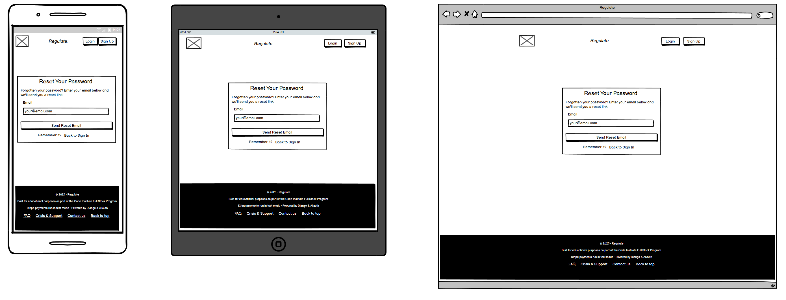

4. **Reset Password – confirmation page**  
Confirmation screen shown after successfully submitting a reset request.

5. **Reset Password – email sent page**  
Notification that a reset link has been generated and sent.

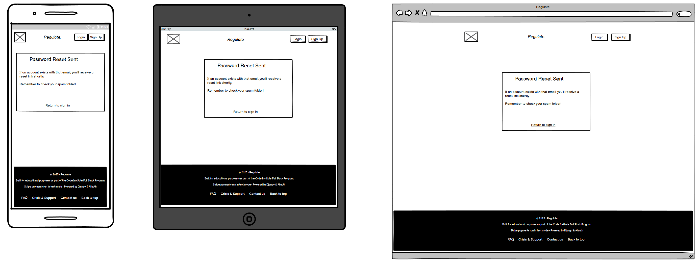

6. **Reset Password – choose new password**  
Form allowing the user to securely set a new password.

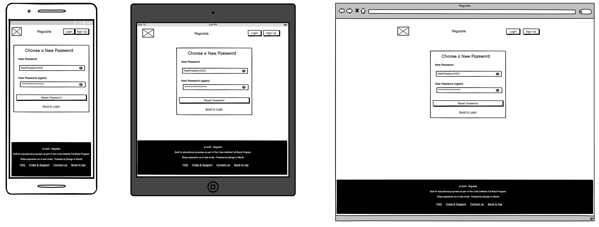

7. **Reset Password – invalid/expired link page**  
Fallback page displayed when a reset token is invalid or expired.

8. **Sign Up page**  
Account creation layout with essential registration fields and plan onboarding messaging.

9. **Home page – after sign in**  
Personalised landing state with quick access to begin a new entry.

10. **New Entry page**  
Core mood entry interface including hue slider, emotion tags, and optional notes.

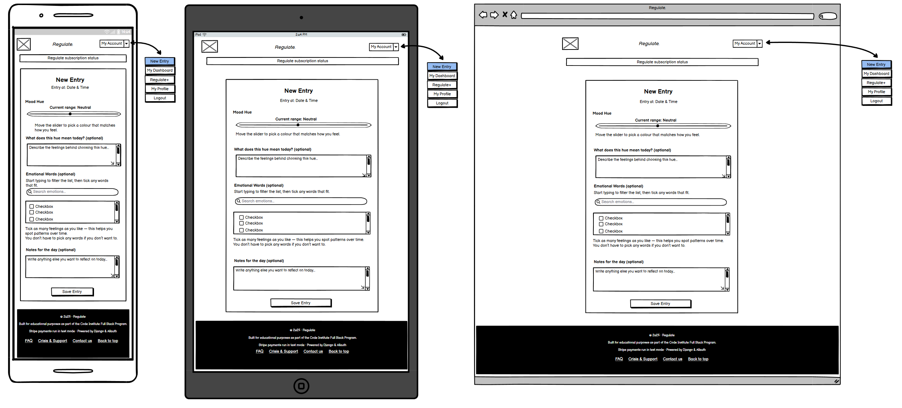

11. **Your Entries page**  
Entry list view showing grouped entries, filtering controls, and action links.

12. **View – Entry Details page**  
Detailed view of a single entry including full notes and revision history access.

13. **Edit Entry page**  
Editable version of an existing entry with update controls.

14. **Dashboard page**  
User home base showing subscription status, entry summary, announcements, and supportive features.

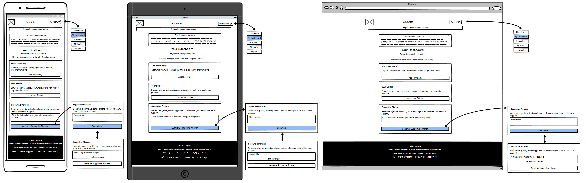

15. **Regulate+ page – Free plan state**  
Subscription overview when the user is on the free plan, showing trial and upgrade options.

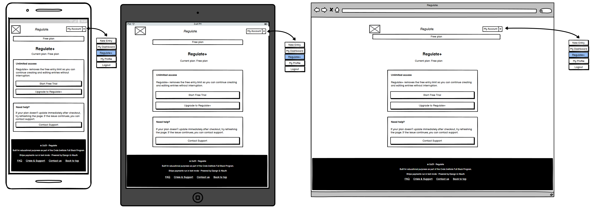

16. **Checkout cancelled page**  
Page displayed when a Stripe Checkout session is exited before completion.

17. **Regulate+ page – Trial/Subscription state**  
Updated subscription page showing billing management options once activated.

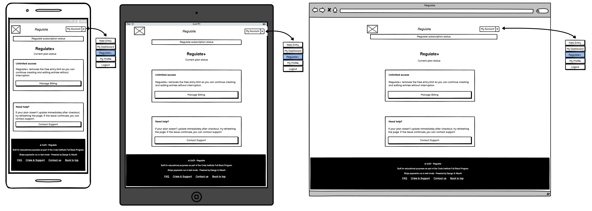

18. **Profile page**  
Account overview page displaying user information and account management links.

19. **Change Username page**  
Form allowing users to update their username.

20. **Change Email page**  
Form allowing users to update their registered email address.

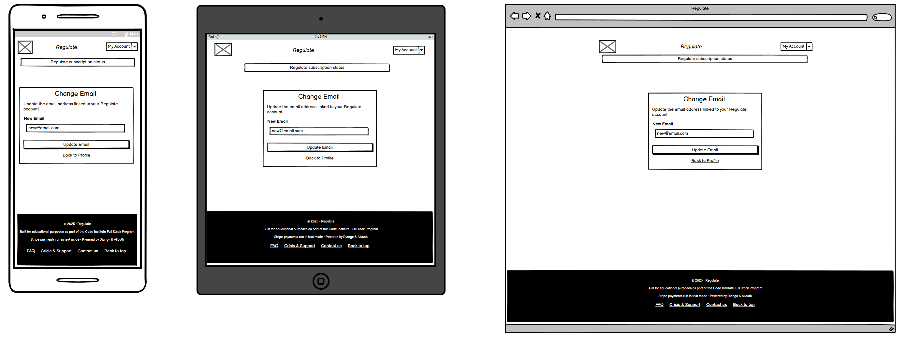

21. **Change Password page**  
Secure password update form with confirmation validation.

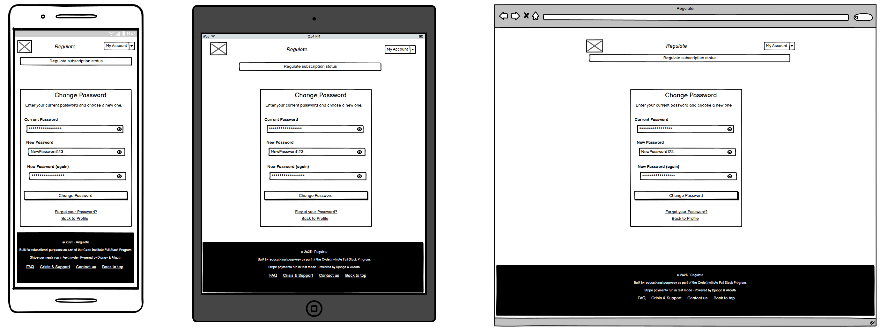

22. **FAQ page**  
Information page answering common usage and subscription questions.

23. **Crisis & Support page**  
Signposting page directing users to trusted external mental health resources.

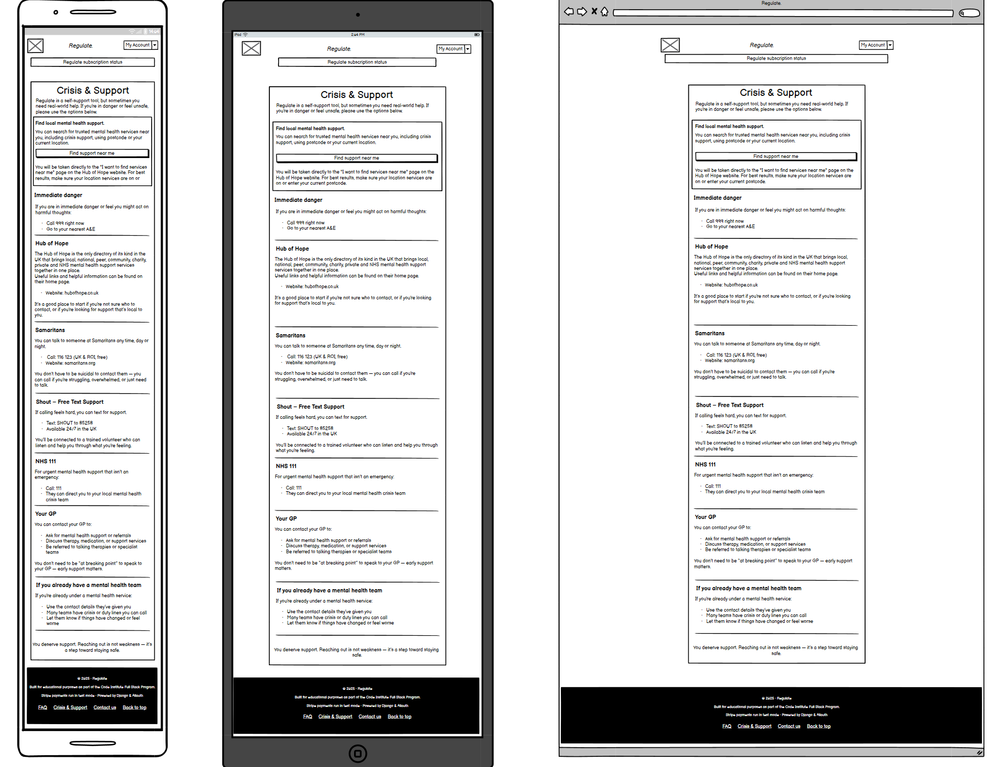

24. **Contact Us page – not signed in**  
Public contact form allowing non-authenticated users to submit enquiries.

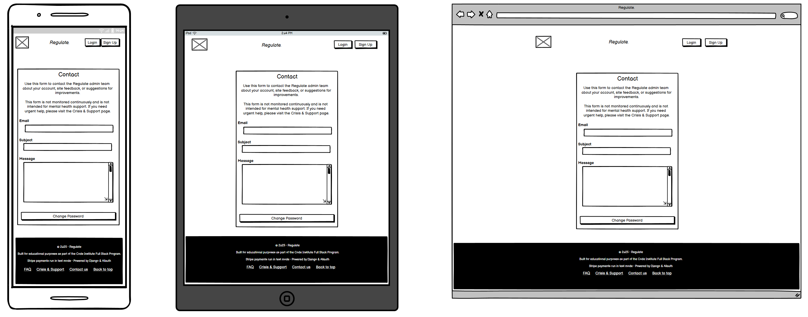

25. **Contact Us page – signed in**  
Authenticated version of the contact form with simplified user identification.

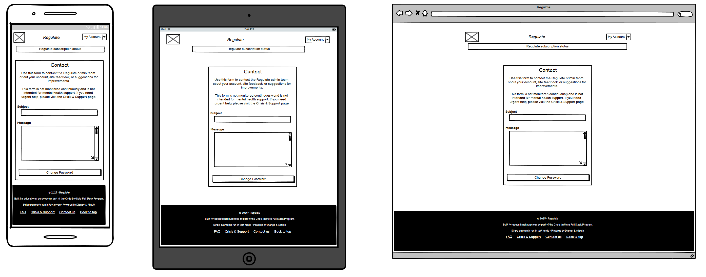

26. **404 error page**  
Custom page displayed when a non-existent route is accessed.

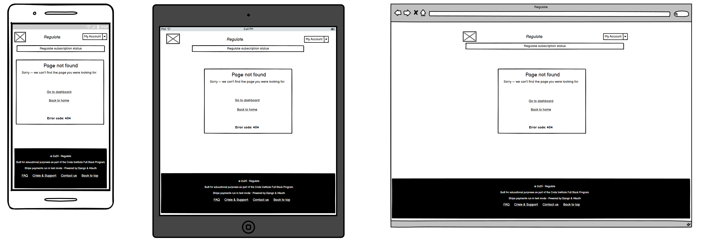

27. **500 error page**  
Fallback page displayed when an unexpected server error occurs.

---

Return to [README.md](../README.md)
